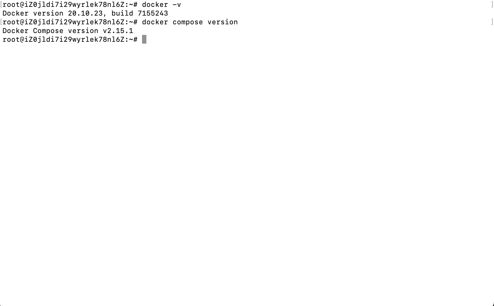
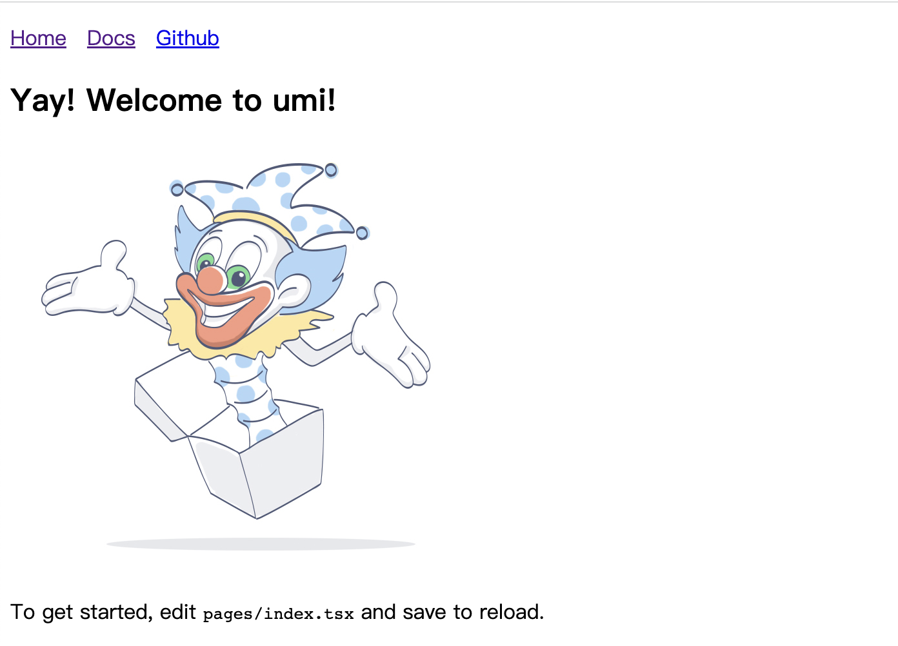
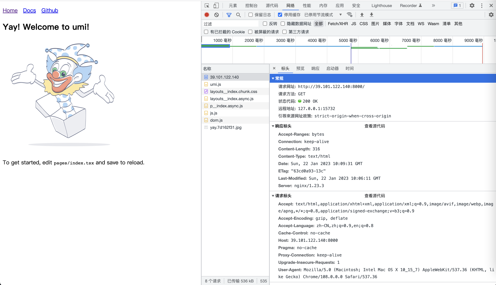
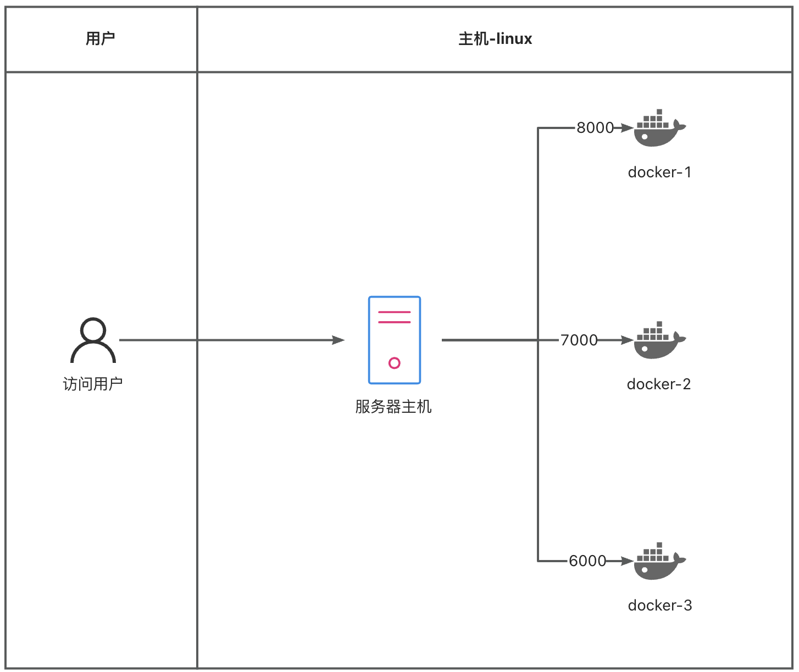

## what-什么是 Docker
官方解释：
Docker是一个用于开发，交付和运行应用程序的开放平台。Docker使您能够将应用程序与基础架构分开，从而可以快速交付软件。借助Docker，您可以以与管理应用程序相同的方式来管理基础架构。通过利用Docker的快速交付，测试和部署代码的方法，您可以显着减少编写代码和在生产环境中运行代码之间的延迟。

其实按照我自己的理解就是：Docker 是一个认可度比较高的部署手段，它能够帮助我们在不同系统中进行服务部署


## why-为什么要使用 Docker
自己本次学习 Docker，只是为了学习和体验一个应用的部署流程；同时本人也对其他的部署方式不太了解，因此这个问题现在其实回答不了；
下面这个事通过搜索引擎看到别人的观点
[为什么要使用Docker](https://www.cnblogs.com/yangmingxianshen/p/8025857.html)

## How-如何使用 Docker 部署应用
这里我们以 CSR 应用举例，部署一个 CSR 应用的步骤应该是：

1. 购买云服务器
2. 在云服务器上安装 Docker，Docker-compose
3. 创建一个 CSR 应用，并且完成打包
4. 完成 Dockerfile 文件
5. 完成 docker-compose.yml 文件
6. 在本地验证 Dockerfile, docker-compose 文件是否正确
7. 完成文件上传脚本，并且完成文件上传
8. 在服务器上启动 docker compose
9. 验证部署是否成功

### 1. 购买云服务器
这种用于自己学习相关内容，倒腾部署的，可以去云服务商那里买一个最低配置最便宜的服务器（如果只是单纯学习，可以只买一个月的）；
题主这里用的是阿里云服务器

### 2. 在云服务器上安装 Docker，Docker-compose
首先我们需要进入服务器的命令行；我们可以直接在服务器控制台进入服务器终端，也可以使用 ssh 连接进入
```
ssh root@39.101.122.140
```

在服务器上安装 Docker，Docker-compose 可以参考官方提供的文档

1. [docker 安装](https://docs.docker.com/engine/install/ubuntu/)
2. [docker compose 安装](https://docs.docker.com/compose/install/linux/#install-the-plugin-manually)

如下图所示，这样就表示我们安装成功了


### 3. 创建一个 CSR 应用，并且完成打包
这里我们直接使用 umi 脚手架创建一个应用
[umi-快速上手](https://umijs.org/docs/tutorials/getting-started)
```
# 创建一个 CSR 应用
npx create-umi@latest

# 完成应用的打包
npm run build
```

### 4. 完成 Dockerfile 文件
```
# 由于我们部署的是一个 CSR 应用，因此我们只要基于 nginx 镜像即可
FROM nginx:latest

# 指定 Docker 的工作目录
WORKDIR '/app'

# 将项目的打包产物拷贝到工作目录中
COPY /dist .
```


### 5. 完成 docker-compose.yml 文件
```
version: '3'
services:
  ## 容器名
  node-app:
    ## 当前目录执行 docker build
    build: .
    ## 端口映射
    ports: 
      - "8000:80"
    # volumes 参数把目录 ./src 挂载到容器的 /app/src
    # docker-compose 的配置中才支持相对路径的挂载
    volumes:
      - ./dist/:/usr/share/nginx/html/
```


### 6. 在本地验证 Dockerfile, docker-compose 文件是否正确 
```
# 运行 docker compose 
docker-compose up --build
```

运行成功之后，我们在浏览器访问链接：http://localhost:8000/
如果发现页面能够正常加载出来，则表示我们的 Dockerfile, docker-compose 配置没有问题


### 7. 完成文件上传脚本，并且完成文件上传
上传脚本的内容如下
```
# /dist
# Dockerfile
# docker-compose.yml

# 将本地文件拷贝到服务器
# 需要保证 /tmp/umiTest 这个文件夹的存在, 因此需要提前创建一个 /tmp/umiTes
# TODO: 待优化项: 理论上，创建文件夹这一步可以通过脚本完成
scp -r ./dist root@39.101.122.140:/tmp/umiTest/dist
scp -r ./Dockerfile root@39.101.122.140:/tmp/umiTest
scp -r ./docker-compose.yml root@39.101.122.140:/tmp/umiTest

# 手动的登录服务器执行 docker compose up --build
```


### 8. 在服务器上启动 docker-compose
```
# 进入文件上传目录
cd /tmp/umiTest

# 启动 docker-compose
docker compose up -d --build
```


### 9. 验证部署是否成功
docker-compose 构建完成之后，在浏览器访问： http://39.101.122.140:8000
如果能够正常获取到页面资源，则表示部署成功了！



## 流量访问 Docker 流程


注意点：
1. 用户通过 域名+端口号访问到服务器主机
2. Docker 通过反向代理，将匹配好的流量（通过端口号匹配）代理到相应的 Docker 容器中

## 参考链接
1. [为什么要使用Docker](https://www.cnblogs.com/yangmingxianshen/p/8025857.html)
2. [docker 安装](https://docs.docker.com/engine/install/ubuntu/)
3. [docker compose 安装](https://docs.docker.com/compose/install/linux/#install-the-plugin-manually)
4. [umi-快速上手](https://umijs.org/docs/tutorials/getting-started)
5. [demo code](https://gitee.com/oulae/oulae_blog_warehouse/blob/main/1_docker%E9%83%A8%E7%BD%B2CSR%E5%BA%94%E7%94%A8.md)
