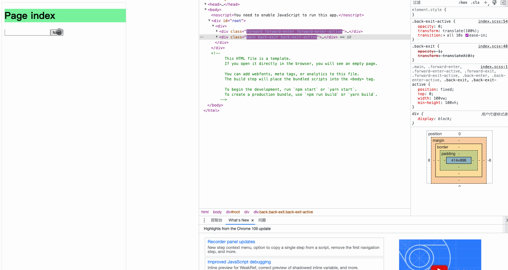
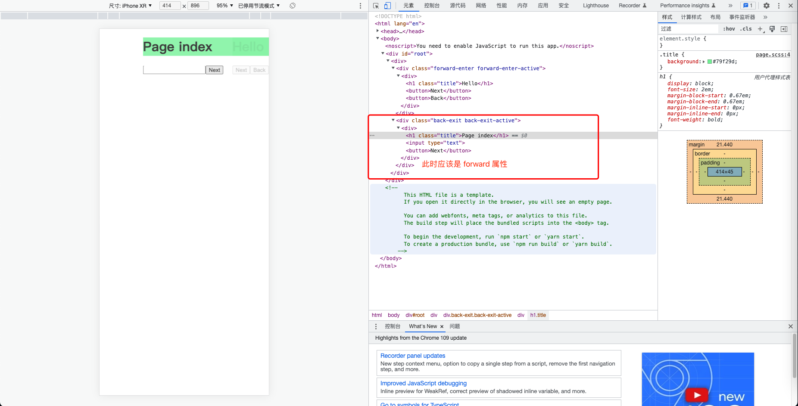

# what - react-transition-group
react-transition-group 是一个用于控制动画过程的库（它是 react 官方团队维护的），它能让你更加方便地管你你动画的流程！
[react-transition-group](https://reactcommunity.org/react-transition-group/)

**本文这里不过多介绍具体的 API 内容，如果想要学习 API 这部分的内容，推荐阅读官方文档**


# 组件级别的过场动画
这里定了两个动画样式
```
.transition-group {
  // 翻页动画
  // 下一页
  &-forward-enter {
    opacity: 0;
    transform: translateX(100%);
  }
  &-forward-enter-active {
    opacity: 1;
    transform: translateX(0);
    transition: all 1s ease-in;
  }
  &-forward-exit {
    opacity: 1;
    transform: translateX(0);
  }
  &-forward-exit-active {
    opacity: 0;
    transform: translateX(-100%);
    transition: all 1s ease-in;
  }
  // 上一页
  &-back-enter {
    opacity: 0;
    transform: translateX(-100%);
  }
  &-back-enter-active {
    opacity: 1;
    transform: translateX(0);
    transition: all 1s ease-in;
  }
  &-back-exit {
    &:extend(.main);
    opacity: 1;
    transform: translateX(0);
  }
  &-back-exit-active {
    &:extend(.main);
    opacity: 0;
    transform: translate(100%);
    transition: all 1s ease-in;
  }

  // 渐入渐出动画
  &-opacity-enter {
    opacity: 0;
  }
  &-opacity-enter-active {
    opacity: 1;
    transition: all 2s ease-in;
  }
  &-opacity-exit {
    &:extend(.main);
    opacity: 1;
  }
  &-opacity-exit-active {
    &:extend(.main);
    opacity: 0;
    transition: all 2s ease-in;
  }
}
```
[dmeo-1_常用过渡动画](./demo/2_使用react-transition-group完成过场动画/1_常用过渡动画)

渐入渐出效果：


翻页效果：


# router过场动画 - umi
## 背景
在 umi4 中使用 react-transition-group 实现路由级别的过滤


## Question
umi4 中，实现不了路由级别的过渡动画，因为 qutlet?.props?.children 这个内容的渲染好像有点问题，会多出一个页面来(目测是 umi4 的问题，因为在 umi3 中其实是有方案做这件事情的)
[2_umi4-transition-group-routers过渡](./demo/2_使用react-transition-group完成过场动画/2_umi4-transition-group-routers过渡/src/layouts/index.tsx)

运行项目之后，我们访问: http://localhost:8000/
触发路由之后，发现过度有点问题：


## 结论
1. umi3 是可以实现路由级别的过度动画的，详见参考链接，umi4 暂时还不行，目测是框架逻辑的原因
2. 如果一定需要实现 CSR 页面路由级别的过度动画，请使用其他脚手架


# router过场动画 - react-create-app
## 背景
在 create-react-app 中使用 react-transition-group 实现路由级别的过滤


# demo
[3_create-react-app-transition-group-router过渡](./demo/2_使用react-transition-group完成过场动画/3_create-react-app-transition-group-router%E8%BF%87%E6%B8%A1)

[核心代码逻辑](./demo/2_使用react-transition-group完成过场动画/3_create-react-app-transition-group-router%E8%BF%87%E6%B8%A1/src/App.jsx)

运行项目之后，我们访问: http://localhost:3000/
过渡效果如下：


# TransitionGroup_childFactory参数的作用
## TransitionGroup 中的 childFactory 参数
TransitionGroup 中有 childFactory 这个参数，它在官方文档中的说明是这样的：
You may need to apply reactive updates to a child as it is exiting. This is generally done by using cloneElement 
however in the case of an exiting child the element has already been removed and not accessible to the consumer.

If you do need to update a child as it leaves you can provide a childFactory to wrap every child, even the ones that are leaving.

您可能需要在 child 退出时对其应用反应性更新。这通常通过使用 cloneElement 来完成,但是，对于现有的子元素，该元素已被删除并且消费者无法访问。
如果您确实需要在 child 离开时更新它，您可以提供一个 childFactory 来包装每个child，甚至是离开的 child。

看着这段话有点迷迷糊糊，那么我们来写一个 demo 理解一下这个参数

## demo
在下面这个 demo 中，我们不使用 childFactory 这个参数，而是直接将 class 绑定到 CSSTransition 组件中
[demo](../demo/4_TransitionGroup_childFactory参数的意思/src/App.jsx#40)
```
return (
  <>
    <TransitionGroup
      // childFactory={(child) => {
      //   console.log('执行到了这里', navgationType)
      //   return React.cloneElement(child, {
      //     classNames: navgationType === 'PUSH' ? 'forward' : 'back',
      //   })
      // }}
    >
      <CSSTransition
        key={location.pathname}
        nodeRef={nodeRef}
        timeout={10000}
        classNames={navgationType === 'PUSH' ? 'forward' : 'back'}
        unmountOnExit
      >
        {(state) => (
          <div
            ref={nodeRef}
            className={navgationType === 'PUSH' ? 'forward' : 'back'}
          >
            {currentOutlet}
          </div>
        )}
      </CSSTransition>
    </TransitionGroup>
  </>
)
```

于是，问题就来了，这样和我们的预期情况好像有点出入：


由上述 gif 可得知：
点击 next 时，DOM 的 class 其实是不对的，他们的正确状态应该为：
Page index：forword-exit
Hello: forwird-enter



我们使用 childFactory 参数之后，过渡动画就变得正常！
```
return (
  <>
    <TransitionGroup
      childFactory={(child) => {
        console.log('执行到了这里', navgationType)
        return React.cloneElement(child, {
          classNames: navgationType === 'PUSH' ? 'forward' : 'back',
        })
      }}
    >
      <CSSTransition
        key={location.pathname}
        nodeRef={nodeRef}
        timeout={10000}
        // classNames={navgationType === 'PUSH' ? 'forward' : 'back'}
        unmountOnExit
      >
        {(state) => (
          <div
            ref={nodeRef}
            // className={navgationType === 'PUSH' ? 'forward' : 'back'}
          >
            {currentOutlet}
          </div>
        )}
      </CSSTransition>
    </TransitionGroup>
  </>
)
```

# 问题原因
**这里没有翻阅过 react-transition-group 源码，这里只是做一个猜测**

```
<TransitionGroup
  // childFactory 是一个 Function 类型参数，它是在交互发生的瞬间调用的（进入/退出），所以这里能够获取到正确地 navgationType
  // 我们可以使用下面这个 console.log 证明，在交互发生的时候会打印语句
  childFactory={(child) => {
    console.log('执行到了这里', navgationType)
    return React.cloneElement(child, {
      classNames: navgationType === 'PUSH' ? 'forward' : 'back',
    })
  }}
>
  <CSSTransition
    key={location.pathname}
    nodeRef={nodeRef}
    timeout={10000}
    // 如果我们在 CSSTransition 中定义，这个属于在编译的那一刻就决定了 classNames 属性值，因此当交互发生的动作和上一个动作冲突时，我们的动画就会发生问题
    // classNames={navgationType === 'PUSH' ? 'forward' : 'back'}
    unmountOnExit
  >
    {(state) => (
      <div
        ref={nodeRef}
        // className={navgationType === 'PUSH' ? 'forward' : 'back'}
      >
        {currentOutlet}
      </div>
    )}
  </CSSTransition>
</TransitionGroup>
```


# 参考链接
1. [github react-transition-group](https://github.com/reactjs/react-transition-group)
2. [document react-transition-group](https://reactcommunity.org/react-transition-group/)
3. [umi 3 中实现路由级别的过渡动画](https://github.com/umijs/umi/issues/4827)
