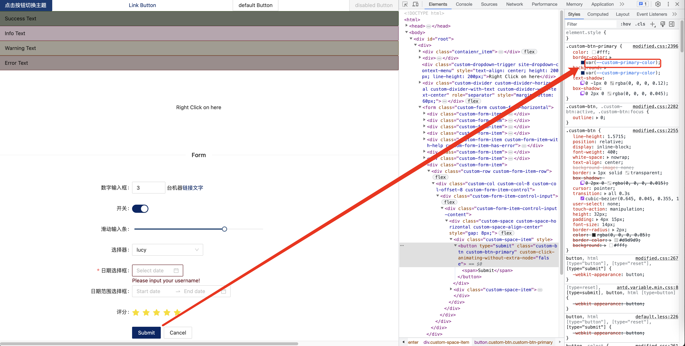

# what

动态主题是指：当用户主动触发某种交互的时候，页面的颜色内容发生变化；
动态主题最常见的场景就是 **黑暗模式**


# 动态主题的实现方式和原理

动态主题的实现方式本质上是和 css 技术栈有关系的：

1. less - less.modifyVars
2. css - var css
3. css in js - js change css

## less.modifyVars

这种方式是在页面引入 less.js 以及 less 文件，然后通过修改 less 变量的方式来达到动态换肤的效果
[demo](./demos/1_modifyVars/index.html)


## var css

这种方式是通过在不同的 css 选择器下面定义 css 变量值来达到动态换肤的小贵
[demo](./demos/2_var_css.html)


## css in js - js change css

css in js 是一种 css 解决方案，它使用 js 将 css 规则插入到页面中
这里以 emotion 为例，我们可以直接修改 theme 对应的主题变量
[demo](./demos/3_emotion-theme/src/layouts/Layout.tsx)


# antd@4 动态主题解决方案

## antd-theme-generator

antd-theme-generator 是一个将 antd 中所有的 less 变量提取成一个单独文件的插件，可以参见下面的资料：
[如何在 umi 系项目中实现动态换肤](https://zhuanlan.zhihu.com/p/347725244)
[Ant Design Runtime Theme Update #10007](https://github.com/ant-design/ant-design/issues/10007)

解决方案的 demo：[demo](./demos/4_antd-theme-g


## antd ConfigProvider

[ConfigProvider - 动态主题](https://4x-ant-design.antgroup.com/docs/react/customize-theme-variable-cn)

ConfigProvider 方案的本质是将 primaryColor 这些公共变量抽象成为 css 变量，然后通过调用 ConfigProvider.config 这个 API 去修改这些变量的值(**即对应的是 css 方案**)



[方案 demo](./demos/4_antd-ConfigProvider/)

运行效果：


## 方案比较

| 方案                 | 优点                                                    | 缺点                                                                                                                                                                                 |
| -------------------- | ------------------------------------------------------- | ------------------------------------------------------------------------------------------------------------------------------------------------------------------------------------ |
| antd-theme-generator | 1. 支持自定义的范围大，至少支持 12 个 less 变量的自定义 | 1. 有些变量可能不支持，比如 @white <br> 2. 对于不antd@4.17 之前的版本兼容性可能比较好，之后的版本边界需要自己确认一下，可能会存在某些变量不能定义的情况 <br> 3. 配置相对而言比较复杂 |
| antd ConfigProvider  | 1. 配置简单                                             | 1. 官网文档上说这个是一个实验方案 2. 支持的变量比较少，只支持 6 个变量                                                                                                               |

ConfigProvider Theme 配置的定义：

```ts
export interface Theme {
  primaryColor?: string;
  infoColor?: string;
  successColor?: string;
  processingColor?: string;
  errorColor?: string;
  warningColor?: string;
}
```

方案建议：

1. 如果自定义主题的场景比较简单，能够使用 ConfigProvider 的 6 个变量实现的话，推荐使用 ConfigProvider 方案
2. 如果 ConfigProvider 不能满足自定义的需求，才推荐使用 antd-theme-generator 方案

# ant@5 动态主题解决方案

antd@5 是基于 css in js 的，因此技术上直接支持动态主题，加上 antd@5 本身对于动态主题支持也很完成，因此这部分建议直接看官方文档即可
[https://ant.design/docs/react/customize-theme-cn](https://ant.design/docs/react/customize-theme-cn)

# QA

## antd-theme-generator 是按需加载还是非按需加载，如果 less 文件发生了变更，antd-theme-generator 能够动态地检测到么?(例如新增了一个组件，可以保证 color.less 文件中存在相应的内容吗？)

由于 antd-theme-generator 是一个 less 文件生成的脚本，如果存在增量内容，是不会有动态检测的

不过可以考虑将这个内容做成 webpack 插件

## 如果 UI 框架是 scss 的话，如果做动态主题

scss 不能做动态处理，因此只能往 var css 方向上靠

## antd 中定义的 less 变量有哪些，如果判断这些变量的影响范围？

[参考链接 - 定制主题](https://4x-ant-design.antgroup.com/docs/react/customize-theme-cn)

根据文档中的描述，antd 中定义的 less 变量有：

```
@primary-color: #1890ff; // 全局主色
@link-color: #1890ff; // 链接色
@success-color: #52c41a; // 成功色
@warning-color: #faad14; // 警告色
@error-color: #f5222d; // 错误色
@font-size-base: 14px; // 主字号
@heading-color: rgba(0, 0, 0, 0.85); // 标题色
@text-color: rgba(0, 0, 0, 0.65); // 主文本色
@text-color-secondary: rgba(0, 0, 0, 0.45); // 次文本色
@disabled-color: rgba(0, 0, 0, 0.25); // 失效色
@border-radius-base: 2px; // 组件/浮层圆角
@border-color-base: #d9d9d9; // 边框色
@box-shadow-base: 0 3px 6px -4px rgba(0, 0, 0, 0.12), 0 6px 16px 0 rgba(0, 0, 0, 0.08),
  0 9px 28px 8px rgba(0, 0, 0, 0.05); // 浮层阴影
```

如果需要判断这些变量的影响范围，我们根据[themes/default.less](https://github.com/ant-design/ant-design/blob/4.x-stable/components/style/themes/default.less)判断

# 参考链接

1. [如何在 umi 系项目中实现动态换肤](https://zhuanlan.zhihu.com/p/347725244)
2. [using-less-in-the-browser](https://lesscss.org/usage/#using-less-in-the-browser)
3. [antd default.less](https://github.com/ant-design/ant-design/blob/4.x-stable/components/style/themes/default.less)
4. [实现 antd 动态主题的两种方式](https://juejin.cn/post/7056415670791208990#heading-17)
5. [antd 定制主题](https://4x-ant-design.antgroup.com/docs/react/customize-theme-cn)
6. [github antd-theme-generator](https://github.com/mzohaibqc/antd-theme-generator)
7. [emotion - 官方文档](https://emotion.sh/docs/community)
8. [emotion - gitub](https://github.com/emotion-js/emotion)
9. [antd@5 文档](https://ant.design/docs/react/customize-theme-cn)
