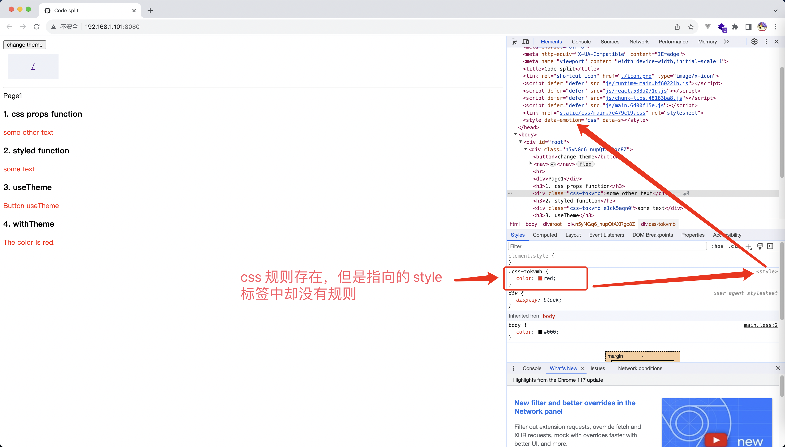
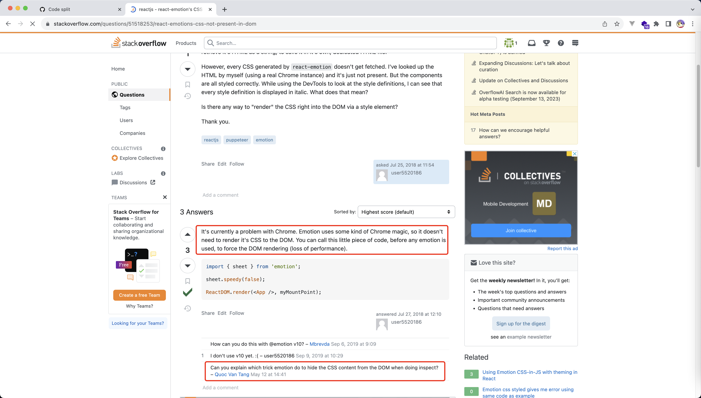
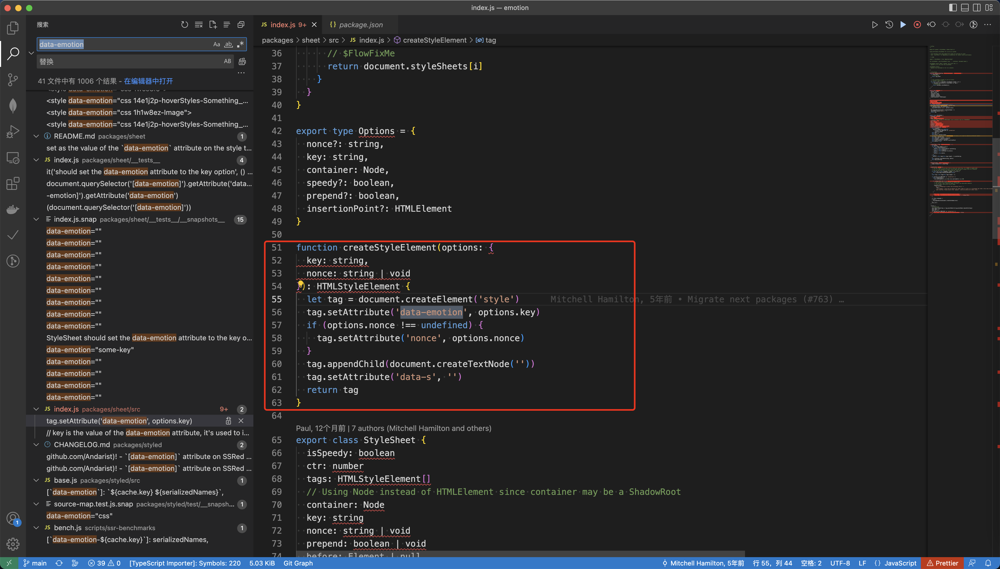
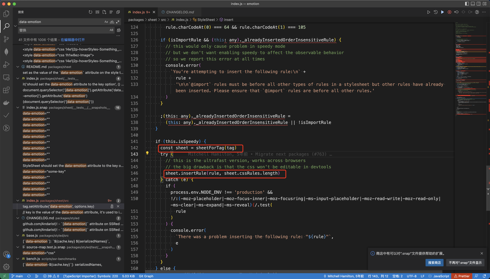
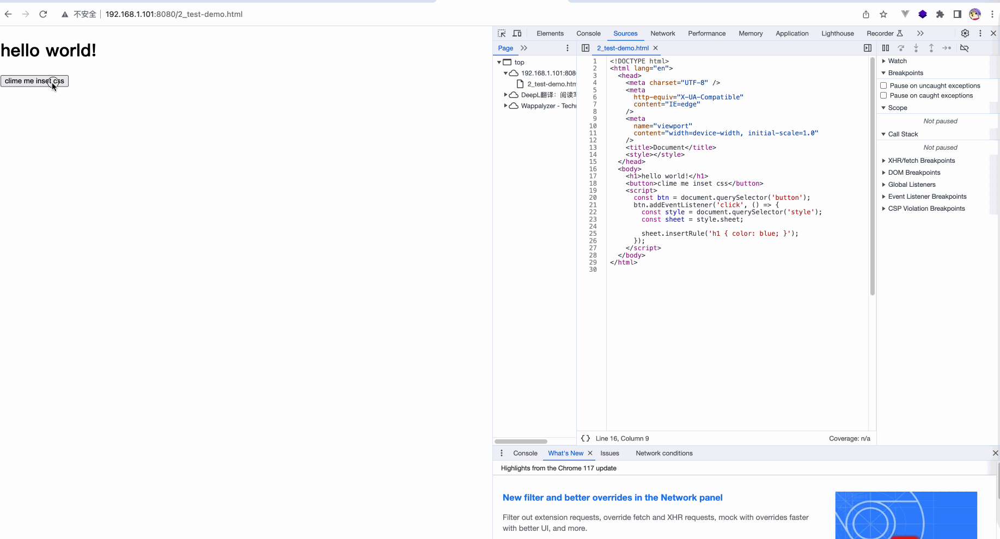

# 问题描述

最近在学 emotion 的时候，发现一个奇怪的现象，emotion 中的 css 内容在 Chrome Inspect Element 中具体找不到！

但是这个 css 确实是存在，于是想弄清楚这个问题是为什么

## 复现路径

[demo](./demo/1_emotion-theme)

```shell
$ npm install
$ npm run build

# build 之后，在 dist 目录使用 http-server 开启服务
$ http-server
```



# 问题搜索

这个问题之前自己完全没有遇到过，于是就以：

```md
如何在 DOM 中隐藏 css 内容
```

关键字搜索资料(chatgpt/stackoverflow/谷歌/百度/掘金)，但是没有找到满意的答案

这里只在 stackoverflow 找到了一个描述类似的，但是没有发现相关答案：
[react-emotion's CSS not present in DOM](https://stackoverflow.com/questions/51518253/react-emotions-css-not-present-in-dom)


# 排查过程

网上查资料无望，此时就只能从 emotion 的源码入手了


观察页面我们发现 emotion 注入的是一个这样的 style 标签

```html
<style
  data-emotion="css"
  data-s=""
></style>
```

**emotion tag: v10.0.0**

于是，已 data-emotion 为关键词在 emotion 代码中搜索

**文件相对位置：/emotion/packages/sheet/src/index.js**

发现这个 style 标签是这样注入到页面中的：


以 createStyleElement 为线索，发现这个 style 标签执行这样的操作：


然后去 MDN 查询 [CSSStyleSheet.insertRule()](https://developer.mozilla.org/zh-CN/docs/Web/API/CSSStyleSheet/insertRule) 资料

终于破案，通过 CSSStyleSheet.insertRule() 可以向页面中插入 css 规则，且插入的规则不会在 Chrome Inspect Element 展示

# 复现 demo

[demo](./demo/2_test-demo.html)

运行结果：


# 结论

终于破案，通过 CSSStyleSheet.insertRule() 可以向页面中插入 css 规则，且插入的规则不会在 Chrome Inspect Element 展示

# 参考链接

1. [CSSStyleSheet.insertRule()](https://developer.mozilla.org/zh-CN/docs/Web/API/CSSStyleSheet/insertRule)
2. [react-emotion's CSS not present in DOM](https://stackoverflow.com/questions/51518253/react-emotions-css-not-present-in-dom)
