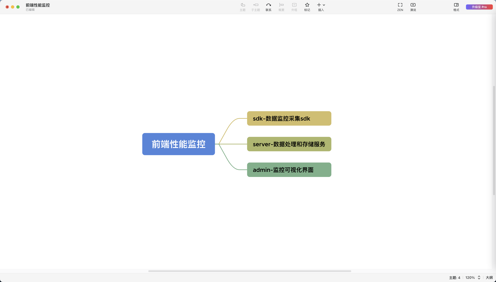
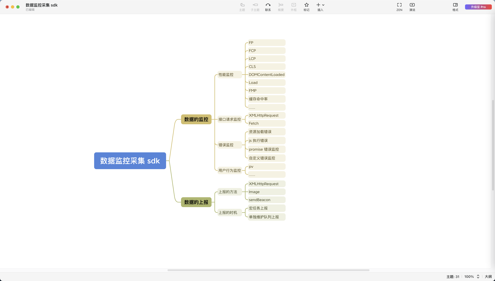
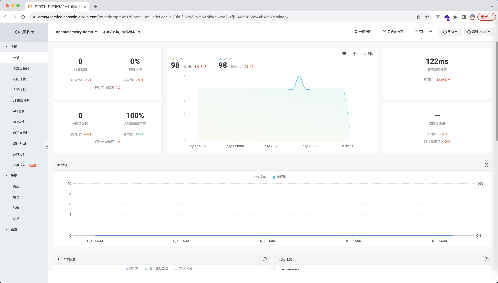
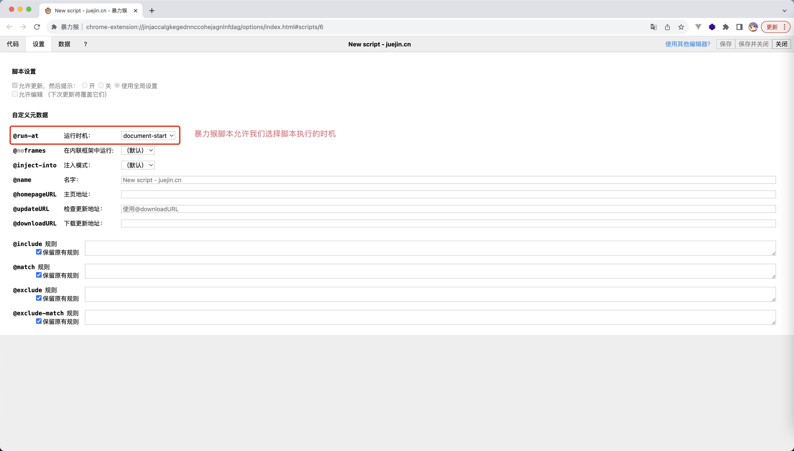

# 写在前面

性能优化&前端监控 这个系列的文章是自己在学习性能优化时的系列总结，这个过程的主要思路为：

1. 基于 Arms 前端监控分析出基本的前端监控架构
2. 分析一个性能监控 sdk 主要需要监控哪些指标，这些指标的监控方式是怎么样的
3. 实现一个基本的性能监控 SDK
4. 对于性能优化有一个普适性的分析框架

# 什么是前端监控

前端监控是一种通过收集、分析和报告前端应用程序在用户端运行时性能、错误和用户行为等信息的方法。这种监控旨在帮助开发人员了解其应用程序在真实用户环境中的表现，以便及时发现和解决问题，提升用户体验。

简而言之，前端监控是指将开发者/业务关心的性能指标数据上报到服务器，然后提供一个可视化的 admin 去查看数据，帮助开发者/业务分析问题的一个工具

一般的，前端性能监控会存在如下 3 个模块:


而我们这里主要关心的是数据监控采集 sdk, 这部分的的主要内容为


## Arms

Arms 是阿里云提供的一种前端监控服务，Arms 的前端监控界面如下：


这个界面的信息其实就是对应了上面数据监控采集 sdk 的所有内容

[ARMS 文档](https://help.aliyun.com/zh/arms/browser-monitoring/product-overview/?spm=a2c4g.11186623.0.0.60a14763VIQ2f9)
[ARMS 官方 demo 入口](https://www.aliyun.com/product/arms?spm=a2c4g.11186623.0.0.8859c773XGgxPs)

## 业务中如何使用前端监控

前端监控是一个复杂度不低的系统，由上面内容可知，它至少是分为 3 个子系统的

因此如何业务中需要配置前端监控，推荐优先使用云服务商提供的工具，非不要不自建服务(自建的话复杂度和成本都比较高，不太划算)

1. [阿里云 - arms](https://www.aliyun.com/product/arms/)
2. [腾讯云 - 前端性能监控工具](https://cloud.tencent.com/document/product/248/87183)
3. [华为云 - 前端性能监控工具](https://support.huaweicloud.com/usermanual-apm2/apm_07_1021.html)

# 前置知识

由于性能优化和前端监控涉及的知识点会比较多，因此这里做一个核心前置知识的总结

## Promise 队列的理解

能够理解下面这段代码的执行结果: 经过 3s 之后，分别输出 1,2

这种利用 promise 维护一个执行队列的套路在实现性能监控 sdk 时非常常用

```
const fn = () => {
  let _reolve = undefined;
  let _reject = undefined;
  const p = new Promise((resolve, reject) => {
    _reolve = resolve;
    _reject = reject;
  });

  setTimeout(() => {
    _reolve();
  }, 3000);

  return p;
};

const log = fn();

log.then(() => {
  console.log(1);
});

log.then(() => {
  console.log(2);
});

```

## Navigation Timing API

对浏览器的 Navigation Timing API 和 PerformanceNavigationTiming 要有基本的理解，因为这个是我们获取浏览器性能指标的基础

推荐资料:

1. [Navigation Timing API 入门](https://juejin.cn/post/6844904182202253325)
2. [PerformanceEntry](https://developer.mozilla.org/zh-CN/docs/Web/API/PerformanceEntry)

## 浏览器的渲染流程


理解浏览器的整个渲染流程，并且能将这个渲染流程的各个节点和 Navigation Timing API 提供的内容相对应

## Chrome 性能优化工具

Chrome 提供的基本性能优化工具要会使用

1. google performance: 查看性能瀑布图
2. google lighthouse: 能够出具一份性能分析报告，可以使用这个工具进行初步的优化
3. google performace insights: performace 的升级版，可读性会更好
4. google layers: 查看页面的层级

[Chrome DevTools](https://developer.chrome.com/docs/devtools/)

## 浏览器的渲染流程

## MutationObserver

[MDN - MutationObserver](https://developer.mozilla.org/zh-CN/docs/Web/API/MutationObserver)

MutationObserver API 提供了监视 DOM 所做更改的能力，在计算 FMP 指标的时候我们需要使用到这个 API

## requestAnimationFrame

[MDN - requestAnimationFrame](https://developer.mozilla.org/zh-CN/docs/Web/API/window/requestAnimationFrame)

requestAnimationFrame 它是浏览器提供的一个 API，它会在每次浏览器重绘之前执行(相当于每一帧渲染之前执行)

### requestAnimationFrame 和 setTimeout 的区别是什么？

**以下回答来源于 chatgpt**
requestAnimationFrame（RAF）和 setTimeout 是用于在浏览器中安排代码执行的两种不同的方法，它们有一些重要的区别：

1. 调用时机：

- setTimeout 会在指定的时间间隔过后将任务添加到任务队列中。但是由于它不考虑浏览器的渲染周期，所以无法确保在每一帧都执行。

- requestAnimationFrame 则会在浏览器下一次重绘之前执行注册的回调函数，通常是每秒 60 次（60fps），以确保更加平滑的动画效果。

2. 性能优化：

- requestAnimationFrame 在进行动画时，如果页面处于未激活状态（例如，用户切换到另一个标签），它会自动暂停，以节省系统资源。而 setTimeout 在这种情况下不会自动暂停，可能会浪费系统资源。

3. 帧同步：

- requestAnimationFrame 提供了一个与浏览器的帧同步的机制，确保回调函数在每一帧之前执行。这对于实现流畅的动画非常有用。

- setTimeout 则没有与浏览器渲染的帧同步，可能导致动画效果不够流畅，尤其是在页面的帧率不稳定的情况下。

4. 取消执行：

- requestAnimationFrame 提供了取消执行的方,cancelAnimationFrame，可以用来停止动画。

- setTimeout 可以通过 clearTimeout 来取消定时器，但是需要记住返回的定时器标识。
  总体而言，如果你正在处理动画或需要与浏览器的渲染周期同步，那么 requestAnimationFrame 是更好的选择。如果你只是需要在一定时间后执行某个任务，而不需要与动画同步，那么 setTimeout 可能更适合。

### 为什么说 setTimeout 绘制动画时，无法保证每一帧都执行

setTimeout 是宏任务，每次事件循环时只会执行一个宏任务，因此 setTimeout 绘制动画时，无法保证每一帧执行，因为页面中很可能存在其他的 setTimeout 或者其他的宏任务

## 测试方案 - 暴力猴插件

有时候，我们的某些脚本需要在 body 解析之前执行，此时我们就可以借助这个插件来完成测试

[暴力猴](https://chrome.google.com/webstore/detail/violentmonkey/jinjaccalgkegednnccohejagnlnfdag?hl=zh-CN)



# 参考链接

## 系列&demo 相关

1. [github blog](https://github.com/ouleWorld/oulae_blog_warehouse/tree/main/markdown/%E6%80%A7%E8%83%BD%E4%BC%98%E5%8C%96)
2. [demos 仓库](https://github.com/ouleWorld/oulae_blog_warehouse/tree/main/markdown/%E6%80%A7%E8%83%BD%E4%BC%98%E5%8C%96/demos)
3. [浏览器渲染流程](https://www.w3.org/TR/navigation-timing-2/timestamp-diagram.svg)

## 参考资料

1. [深入了解前端监控原理](https://juejin.cn/post/6899430989404045320)
2. [前端监控 SDK 的一些技术要点原理分析](https://juejin.cn/post/7017974567943536671#heading-35)
3. [腾讯二面：现在要你实现一个埋点监控 SDK，你会怎么设计？](https://juejin.cn/post/7085679511290773534#heading-6)
4. [ARMS 文档](https://help.aliyun.com/zh/arms/browser-monitoring/product-overview/?spm=a2c4g.11186623.0.0.60a14763VIQ2f9)
5. [ARMS 官方 demo 入口](https://www.aliyun.com/product/arms?spm=a2c4g.11186623.0.0.8859c773XGgxPs)
6. [Navigation Timing API 入门](https://juejin.cn/post/6844904182202253325)
7. [PerformanceEntry](https://developer.mozilla.org/zh-CN/docs/Web/API/PerformanceEntry)
8. [暴力猴](https://chrome.google.com/webstore/detail/violentmonkey/jinjaccalgkegednnccohejagnlnfdag?hl=zh-CN)
