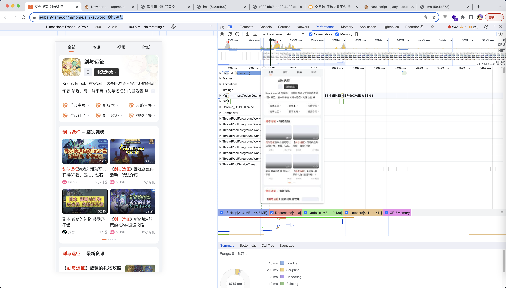
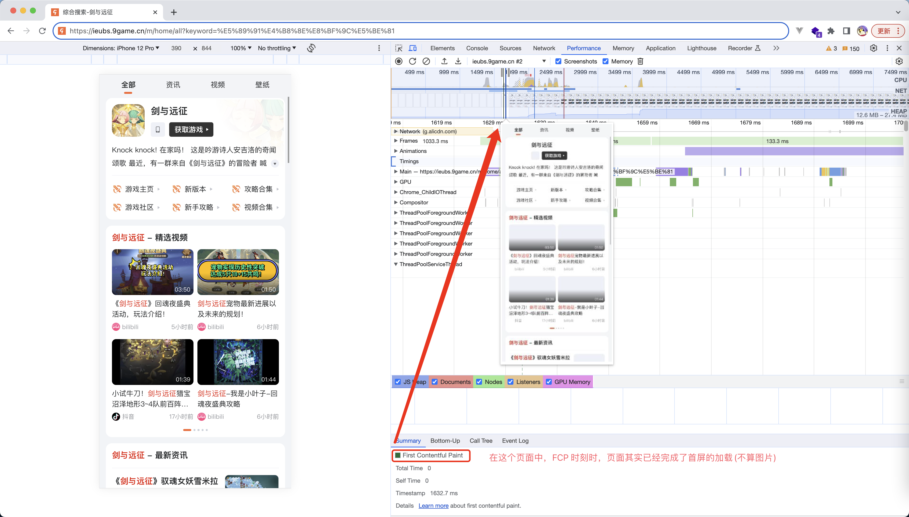
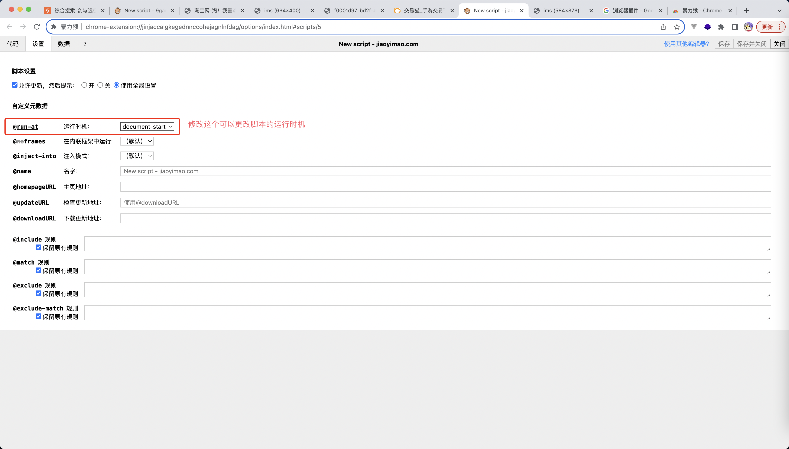
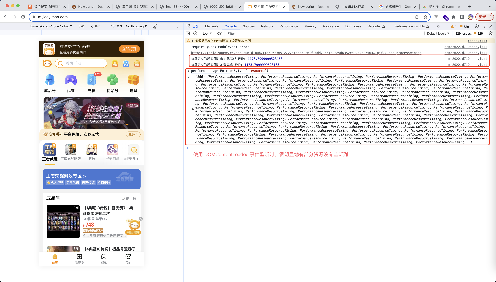

# 阅读须知

**如果指标中定义标注了超链接，则建议直接阅读超链接资料进行指标的理解**

# 常用指标

## FP

定义: 从页面加载开始到第一个像素绘制到屏幕上的时间
计算方法:

```js
const entries = performance.getEntries();
let t1 = undefined;

entries.forEach((ele) => {
  if (ele.name === 'first-paint') {
    t1 = ele.startTime - p.fetchStart;
  }
});
```

## FCP

定义: [First Contentful Paint (FCP)](https://web.dev/articles/fcp?hl=zh-cn)
计算方法:

```js
const entries = performance.getEntries();
let t2 = undefined;

entries.forEach((ele) => {
  if (ele.name === 'first-contentful-paint') {
    t2 = ele.startTime - p.fetchStart;
  }
});
```

## LCP

定义: [https://web.dev/articles/lcp?hl=zh-cn](https://web.dev/articles/lcp?hl=zh-cn)
计算方法:

```js
new PerformanceObserver((entryList) => {
  for (const entry of entryList.getEntries()) {
    console.log('LCP DOM=', entry.element, `time=${entry.startTime}`);
  }
}).observe({ type: 'largest-contentful-paint', buffered: true });
```

注意点：

1. 在一个页面中，LCP 的指标是可能存在多个的
2. 如果业务场景很关心 LCP 指标的话，推荐阅读 [web-vitals onLCP](https://github.com/GoogleChrome/web-vitals/blob/main/src/onLCP.ts) 资料
3. LCP 技术设计上是一个 FMP 的等性质表，不过具体的细节是根据业务场景来决定的

### LCP 会存在多个值

LCP 指标定义是报告视口内可见的最大图片或文本块的呈现时间，其意义和 FMP 是相似的，但是根据 FMP 的算法，针对同一个页面我们可能会计算出多个 FMP 值：


**因此如果业务上需要这个指标来衡量加载速度的话，需要提前对齐到底采用那个元素的加载速度**

## CLS

定义: [Cumulative Layout Shift (CLS)](https://web.dev/articles/cls?hl=zh-cn)
计算方法:

```js
new PerformanceObserver((entryList) => {
  for (const entry of entryList.getEntries()) {
    console.log('Layout shift:', entry);
  }
}).observe({ type: 'layout-shift', buffered: true });
```

注意点:

1. 如果业务场景关心 CLS 指标，推荐阅读 [github onCLS](https://github.com/GoogleChrome/web-vitals/blob/main/src/onCLS.ts)

TODO: 这里可以添加一个图片的 CLS 场景

## DOMContentLoaded

定义: 当初始的 HTML 文档被完全加载和解析完成之后，DOMContentLoaded 事件被触发，而无需等待样式表、图像和子框架的完全加载。
计算方法:

```js
const entries = performance.getEntries();
const p = entries[0];

const DCL = p.domContentLoadedEventEnd - p.fetchStart;
```

## load

定义: 页面所有资源加载完成
计算方法:

```js
const entries = performance.getEntries();
const p = entries[0];

const L = p.loadEventEnd - p.fetchStart;
```

## FMP

定义: First Meaningful Paint, 首屏渲染时间(**移动端场景下可能会比较关注这个指标**)

这里需要注意一个点，FMP 其实也是存在两种情况的：

1. 首屏定义为所有图片未加载完成
2. 首屏定义为所有图片加载完成

举个例子：

示例网站：https://ieubs.9game.cn/m/home/all?keyword=%E5%89%91%E4%B8%8E%E8%BF%9C%E5%BE%81

如果首屏定位所有图片未加载完成，则 FMP 应该为这种状态


如果首屏定义为所有图片加载完成，则 FMP 应该为这种状态


FMP 这个指标是一个较复杂的指标，参照 [First Meaningful Paint](https://developer.chrome.com/docs/lighthouse/performance/first-meaningful-paint/) 查看

简单来说就是，浏览器本身并没有提供一个 API 去查询页面的 FMP 指标(Chrome Lighthouse 有提供，但是这样不具备 SDK 数据上报的能力)

因此业务如果关注这个指标的话，需要自己去计算这个指标，下面提供几种计算的思路

### SSR 页面，使用 FCP 进行替换

**这种情况下，默认首屏定义为所有图片未加载完成**

在 SSR 的场景下，由于服务器是直接返回所有的 HTML 的，此时页面直接渲染 HTML 就可能完成页面绘制，不需要等待 js 解析器的运行，因此页面渲染速度会较快；这种情况下，我们可以直接使用 FCP 指标替代 FMP (会有误差，但是不会太大)

### 使用 LCP 替换 FMP

下面我们来举一个例子:

测试链接: https://ieubs.9game.cn/m/home/all?keyword=%E5%89%91%E4%B8%8E%E8%BF%9C%E5%BE%81


不过这里有一个注意点，一个页面的 LCP 值是会存在多个的


因此我们使用 FCP 进行作为首屏渲染时间指标时，需要进行数据过滤：

1. 上报时过滤
2. 数据报表过滤

### 使用 MutationObserver 手动计算首屏渲染时间

**这种方案兼容两种情况，既可以计算首屏定义为所有图片未加载完成，也可以计算首屏定义为所有图片加载完成**

**算法来源: [前端监控 SDK 的一些技术要点原理分析](https://juejin.cn/post/7017974567943536671), 感兴趣的读者可以参见这个链接去了解**

这里简单阐述一下计算过程：

1. 利用 MutationObserver 监听 document 对象，每当 document 插入新的 DOM 时，触发计算
2. 判断当前元素是否处于首屏内，如果处于首屏内，则使用 performance.now() 获取时间(requestAnimationFrame API 回调中获取，即重绘操作之前)
3. 如果首屏的定义包括图片，则将最后一个渲染的 DOM 和所有加载图片来做一次时间对比，将最大值作为首屏渲染时间

计算方法:
[2_FMP 计算脚本](./demos/2_FMP%E8%AE%A1%E7%AE%97%E8%84%9A%E6%9C%AC.js)

#### 调试方法：如何在 web 渲染 body 之前插入自定义脚本

FMP 的计算脚本有点特殊，由于它使用 MutationObserver API 监听了 document 的变化，因此我们的脚本必须在 body tag 之前运行才行

要是先这个目的，我们可以使用浏览器插件: [暴力猴](https://chrome.google.com/webstore/detail/violentmonkey/jinjaccalgkegednnccohejagnlnfdag?hl=zh-CN)



#### 注意点:获取 FMP 的时机问题

上面的获取方式中，我们在 load 时机进行 FMP 的获取，**这个时机是不能替换为 DOMContentLoaded 的**，如果替换为 DOMContentLoaded，那么很可能在 DOMContentLoaded 这个时机，图片的请求还没有发出去，这使得 performance.getEntriesByType('resource') 获取不到首屏的图片 PerformanceResourceTiming，从而造成计算误差

测试链接: https://m.jiaoyimao.com/

使用 load 计算 FMP


使用 DOMContentLoaded 计算 FMP


#### 注意点: 该算法计算 FMP 是存在误差的

这个算法计算出来的 FMP 其实是要小于真实的 FMP 的，这个其实很好理解

在首屏定义为所有图片未加载完成的情况时，由于我们取的时间是重绘之前的那一帧的时间，因此会比真实的 FMP 偏小(因为重绘是需要时间的)

在首屏定义为所有图片加载完成的情况时，我们是使用图片加载完成的那一刻的时间作为 endTime 的，因此会比真实的 FMP 偏小(因为图片的绘制需要时间)

不过这种误差是很小的，只要工具的口径定义好的，计算出来的 FMP 对业务来说还是具备有参考价值的

### 其他计算 FMP 的方法

FMP 的计算其实算是一个有争议的点，可能各个不同的工具都有一套计算方案，如果业务线本身购买了云服务商的相关服务，可以查阅文档看一下 FMP 的计算方法

**这个算是 FMP 这个指标的特殊点，其他指标的计算方式都是大差不差的，但是 FMP 可能会存在自建算法的可能性**

例如，阿里云的监控工具 arms 就提供了一种算法：

1. [页面访问速度](https://help.aliyun.com/zh/arms/browser-monitoring/user-guide/page-loading-speed?spm=a2c4g.11186623.0.0.6f8f615eevFD5E)
2. [前端监控 - 首屏统计的前世今生](https://zhuanlan.zhihu.com/p/44933789)

**如果要使用云服务商监控工具提供的 FMP 计算方法，一定要注意验证是否契合业务，笔者之前业务线使用 arms 计算出来的首屏差异就相对来说比较大**

## 缓存命中率

定义: js,css,图片这些资源中使用缓存的占比
原理:

```js
function isCache(entry) {
  // 直接从缓存读取或 304
  return (
    // 强制缓存的情况
    entry.transferSize === 0 ||
    // 协商缓存的情况
    (entry.transferSize !== 0 && entry.encodedBodySize === 0)
  );
}
```

计算:

```js
const getCacheData = () => {
  const result = {
    // js 缓存相关
    jsCacheAll: 0,
    jsCacheNumbers: 0,
    // css 缓存相关
    cssCacheAll: 0,
    cssCacheNumbers: 0,
    // img 缓存相关
    imgCacheAll: 0,
    imgCacheNumbers: 0,
  };

  const entries = performance.getEntries();

  /**
   * 判断资源是否命中了缓存
   * @param {*} entry
   * @returns
   */
  const isCache = (entry) => {
    // 直接从缓存读取或 304
    return (
      // 强制缓存的情况
      entry.transferSize === 0 ||
      // 协商缓存的情况
      (entry.transferSize !== 0 && entry.encodedBodySize === 0)
    );
  };

  /**
   * 判断资源的类型
   * @param {*} item
   * @returns
   */
  const judgeEntriesType = (item) => {
    const { initiatorType, name } = item;

    if (initiatorType === 'link' && name.includes('.css')) {
      return 'css';
    } else if (initiatorType === 'script' && name.includes('.js')) {
      return 'js';
    } else if (initiatorType === 'img' && !name.includes('hm.baidu.com')) {
      return 'img';
    }

    return 'other';
  };

  entries.forEach((ele) => {
    const type = judgeEntriesType(ele);
    if (type !== 'other') {
      const indexAll = `${type}CacheAll`;
      const indexNumbers = `${type}CacheNumbers`;

      result[indexAll] += 1;
      if (isCache(ele)) {
        result[indexNumbers] += 1;
      }
    }
  });

  console.log(result);
  return result;
};
```

# 非常用指标

## DNS 解析耗时

定义: url DNS 解析耗时
计算方法:

```js
const entries = performance.getEntries();
const p = entries[0];
const DNSTime = p.domainLookupEnd - p.domainLookupStart;
```

## TCP 连接耗时

定义: 建立 TCP 连接耗时
计算方法:

```js
const entries = performance.getEntries();
const p = entries[0];
const TCPTime = p.connectEnd - p.secureConnectionStart;
```

## SSL 安全链接耗时

定义: SSL 安全链接建立完成的耗时
计算方法:

```js
const entries = performance.getEntries();
const p = entries[0];
const SSLTime = p.connectEnd - p.connectStart;
```

## Request 耗时

定义: 网页加载流程中 Request 的耗时
计算方法:

```js
const entries = performance.getEntries();
const p = entries[0];
const urlRequestTime = p.responseStart - p.requestStart;
```

## Response 耗时

定义: 网页加载流程中 Response 的耗时
计算方法:

```js
const entries = performance.getEntries();
const p = entries[0];
const urlResponseTime = p.responseEnd - p.requestStart;
```

## html 文档加载耗时

定义: 从输入 url 开始加载资源到获取到 url html 资源所消耗的时间
计算方法:

```js
const entries = performance.getEntries();
const p = entries[0];
const htmlLoadTime = p.responseEnd - p.fetchStart;
```

## FPS

定义: 页面刷新的频率
计算原理: FPS = 刷新次数 / 时间
计算:
[5_FPS 计算脚本](./demos/5_FPS%E8%AE%A1%E7%AE%97%E8%84%9A%E6%9C%AC.js)

测试方案: FPS 的此时需要我们在 body 之前执行完脚本，因此需要使用到 [暴力猴](https://chrome.google.com/webstore/detail/violentmonkey/jinjaccalgkegednnccohejagnlnfdag?hl=zh-CN) 插件

## 页面中 tag 的数量

定义: 页面中 tag 标签的数量

```js
const domTagNumber = document.getElementsByTagName('*').length;
```

# 脚本

## 性能指标计算脚本

[1\_性能指标计算脚本](./demos/1_%E6%80%A7%E8%83%BD%E6%8C%87%E6%A0%87%E8%AE%A1%E7%AE%97%E8%84%9A%E6%9C%AC.js)

## FMP 计算脚本

[2_FMP 计算脚本.js](./demos/2_FMP%E8%AE%A1%E7%AE%97%E8%84%9A%E6%9C%AC.js)

```md
Q: 为什么 FMP 的计算脚本要和性能指标计算脚本分开写呢？
A:

首先，这里的脚本主要是用于本地分析的，不是应用于生产环境的数据上报

这里分开完成的核心原因是因为：

对于 性能指标计算脚本 而言，是没有执行时机的要求的，你可以直接在控制台执行即可

但是对于 FMP 计算脚本，它必须在 body tag 之前完成执行

所以基于这个原因，把这两个脚本分开完成了
```

## FPS 计算脚本

[5_FPS 计算脚本](./demos/5_FPS%E8%AE%A1%E7%AE%97%E8%84%9A%E6%9C%AC.js)

# 参考链接

1. [web.dev](https://web.dev/explore/fast?hl=zh-cn)
2. [github - web-vitals](https://github.com/GoogleChrome/web-vitals/tree/main)
3. [前端监控 SDK 的一些技术要点原理分析](https://juejin.cn/post/7017974567943536671)
4. [深入了解前端监控原理](https://juejin.cn/post/6899430989404045320)
