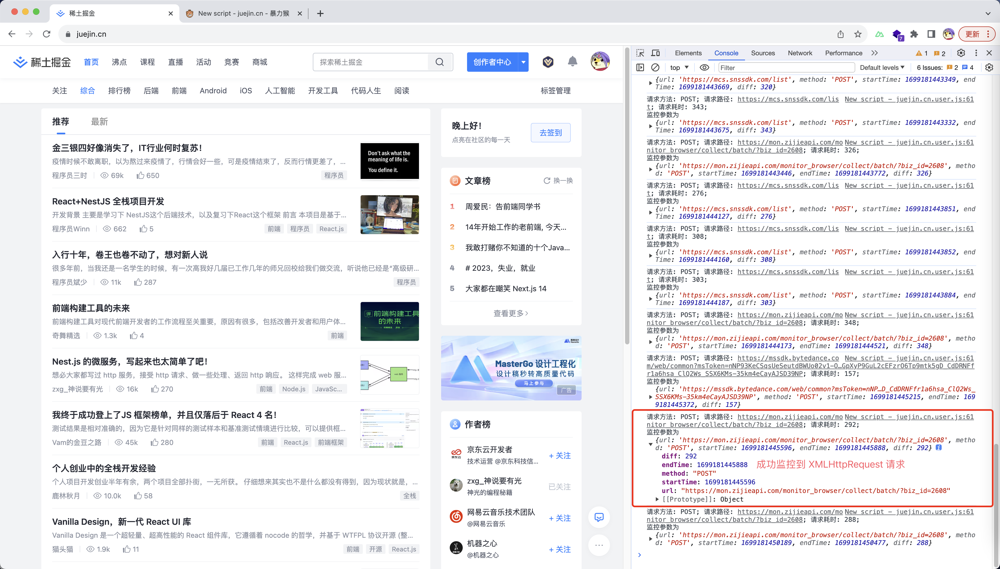

# 接口监控

在 js 页面中，接口请求的方式其实总共只分为两种:

1. XMLHttpRequest
2. Fetch

因此，接口的监控其实就是需要为了兼容这两种监控的情况

## 接口监控的关注点及实现的基本思路

如果要进行接口监控，我们可能会关注下面这些指标：

1. 接口的成功率
2. 接口的请求耗时
3. 接口请求的 UV/PV
4. 其他指标....

针对这些内容，我们需要怎么做才能够获取这些指标呢？

如果之前有做过埋点的同学应该会很快反应过来，这种情况下，我们只需要在接口请求成功之后发送一个埋点，然后根据不同的场景去建立报表即可(本质上就是一个数据库查询的过程)

因此，接口的监控我们本质上只需要在接口完成时发送一个埋点即可，埋点中的参数存在着 业务/开发 关心的内容

## 接口监控方式

### XMLHttpRequest

[XMLHttpRequest 接口类型脚本](./demos/3_XMLHttpRequest%E8%AF%B7%E6%B1%82%E8%80%97%E6%97%B6%E7%9B%91%E6%8E%A7/XMLHttpRequestTimeScript.js)
[demo](./demos//3_XMLHttpRequest%E8%AF%B7%E6%B1%82%E8%80%97%E6%97%B6%E7%9B%91%E6%8E%A7/index.html)

```md
Q: XMLHttpRequestTimeScript 脚本中为什么需要提供一个 paramsFormat 呢？(为什么这里需要这么设计)

A:
在监听的时候，作为监控 SDK 的维护方，我们不可能枚举所有的监控参数和监控场景(如果所有参数都写入埋点对于数据库存储时不友好的，会增加存储成本)
因此这里我们可以将参数的上报格式交由具体的开发者去管理，我们只需要关注上报即可
同时这里我们直接把 response 返回给开发者了，则接口请求的成功与否直接交由给开发者维护了
```

#### 在第 3 方页面测试脚本

测试方案: [暴力猴](https://chrome.google.com/webstore/detail/violentmonkey/jinjaccalgkegednnccohejagnlnfdag?hl=zh-CN)

测试链接: [掘金首页](https://juejin.cn/)



### Fetch

[Fetch 接口类型脚本](./demos/4_Fetch%E8%AF%B7%E6%B1%82%E8%80%97%E6%97%B6%E7%9B%91%E6%8E%A7/FetchScript.js)
[demo](./demos/4_Fetch%E8%AF%B7%E6%B1%82%E8%80%97%E6%97%B6%E7%9B%91%E6%8E%A7/index.html)

**Fetch 的思路和设计基本上和 XMLHttpRequest 是一致的**

## 接口监控的原理

XMLHttpRequest 和 Fetch 的原理本质上就是重写浏览器提供的 XMLHttpRequest，Fetch 对象，添加一些我们定义的回调函数
具体可以参见实现的脚本

# 错误监控

JS 中的错误监控分为下面 3 类

1. 资源加载错误
2. js 错误
3. promise 错误

## 资源加载错误

页面中资源加载错误，我们可以通过 监听 error 错误来实现捕获

监听核心代码:

```js
window.addEventListener(
  'error',
  (e) => {
    const { target } = e;
    const tag = target.tagName;
    const url = target.src || target.href;
    console.log(`捕获到了加载错误, 加载标签类型为 ${tag}; 资源 url 为 ${url}`);
  },
  // 错误的监听必须在捕获的时候进行监听
  true
);
```

demo: [6\_资源加载错误](./demos/6_%E8%B5%84%E6%BA%90%E5%8A%A0%E8%BD%BD%E9%94%99%E8%AF%AF.html)


## js 错误

对于 js 中的执行错误，我们可以通过 window.onerror 来监听

监听的核心代码:

```js
window.onerror = (message, source, lineno, colno, error) => {
  console.log('捕获到异常：', { message, source, lineno, colno, error });
};
```

demo: [7_js 中的执行错误](./demos/7_js%E4%B8%AD%E7%9A%84%E6%89%A7%E8%A1%8C%E9%94%99%E8%AF%AF.html)


注意点：

1. 如果你的代码中存在语法错误，则 onerror 是监听不到的！例如我们上述的 demo 中修改了 const 变量的赋值，但是并不没有捕获到这个错误

## promise 错误

对于未处理的 promise 错误，我们可以监听 unhandledrejection 错误

监听的核心代码：

```js
window.addEventListener('unhandledrejection', (e) => {
  console.log('e: ', e);
});
```

demo: [8_promise 错误](./demos/8_promise%E9%94%99%E8%AF%AF.html)


## React 框架错误的采集

react 错误采集使用 React 提供的 ErrorBoundary 即可，可阅读下面的资料: [Displaying an error to users with a error boundary ](https://react.dev/reference/react/useTransition#displaying-an-error-to-users-with-error-boundary)
