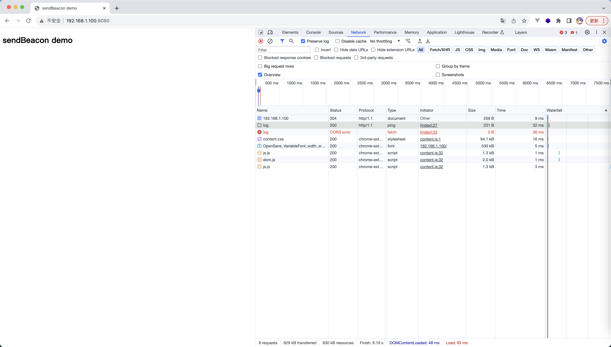

# 性能数据埋点的上报

性能数据埋点的上报我们其实需要考虑 2 个问题：

1. 非阻塞上报
2. 使用什么方式进行埋点上报
3. 上报的时机

# 非阻塞上报

一般的，我们的性能埋点工具都是抽象成为一个 sdk 的方式，这样能方便多项目的接入

这个 SDK 一般是需要初始化的，我们在初始化的阶段可能会进行如下的操作：

1. 身份校验初始化，获取身份标识(如果是付费的性能监控 SDK 的话)
2. 公参的初始化
3. ...

总之，我们需要在初始化之后我们的埋点才能够正常发送出去，而很有可能得情况是，我们在初始化就需要进行埋点的调用(比如发送一个 pv 点)，写成伪代码的方式如下:

```js
const PerformaceOulaeSdk = function () {};

PerformaceOulaeSdk.prototype.init = function () {
  // 假设 init 的执行时间需要 3 s
};

PerformaceOulaeSdk.prototype.log = function (...params) {
  console.log('发起了埋点');
};

const sdk = new PerformaceOulaeSdk();
// 初始化完成之后，我们需要马上发送一个 pv 点
sdk.log('pv');
```

所以我们需要一个机制来保证：在 sdk 初始化成功之后，我们的埋点工具能够依次正常的发送所有埋点

而解决方案就是 promise 队列: [9\_埋点的非阻塞上报](./demos/9_%E5%9F%8B%E7%82%B9%E7%9A%84%E9%9D%9E%E9%98%BB%E5%A1%9E%E4%B8%8A%E6%8A%A5.js)

```js
const PerformaceOulaeSdk = function () {
  this.promiseCache = Promise.resolve();
};

PerformaceOulaeSdk.prototype.init = function () {
  let _resolve = undefined;
  let _reject = undefined;
  this.promiseCache = new Promise((resolve, reject) => {
    _resolve = resolve;
    _reject = reject;
  });

  // 这里假设我们的初始化流程是非常慢的，最起码需要 3 秒钟
  setTimeout(() => {
    _resolve();
  }, 3000);
};

PerformaceOulaeSdk.prototype.log = function (...params) {
  this.promiseCache.then(() => {
    // 调用埋点
  });
};
```

# 埋点上报的方式

一般的埋点上报的方式有 3 种：

1. XMLHttpRequest
2. Image 对象
3. sendBeacon

性能排序: sendBeacon > Image 对象 > XMLHttpRequest

## XMLHttpRequest

这个无需多说，就是普通的 ajax 请求

## Image

[10\_埋点 img](./demos/10_%E5%9F%8B%E7%82%B9img.html)

核心代码:

```js
const imgLog = (...params) => {
  const img = new Image();
  // 这个是知乎的埋点地址
  img.src = 'https://sugar.zhihu.com/glory_adreaper/glory_log?name=oulae';
};
```

使用 img 标签的优势:

1. 没有跨域限制，埋点场景不需要考虑跨域的问题

### 使用 Image 对象进行埋点时，为什么请求的 url 通常是一张 1\*1 的 GIF 图呢？

1. 1\*1 像素的图片中，gif 格式的图片是最小的
2. 如果 response 返回 204，会触发 img 的 onerror 事件，并抛出一个全局错误；如果返回 200 和一个空对象则会有一个 CORB 警告

**事实上，某些工具其实也会采用返回一个空对象的处理方式**

## sendBeacon

[MDN sendBeacon](https://developer.mozilla.org/zh-CN/docs/Web/API/Navigator/sendBeacon)

定义: sendBeacon 是一种浏览器定义的用来发送数据统计的 API，它存在着如下的优势：

1. 能够保证数据发送的可靠性(页面卸载的场景下能保证请求发送成功)
2. 数据的异步传输(可以理解为请求的发送会在浏览器资源空闲时去做)
3. 不影响下一导航的载入(不阻塞页面刷新和跳转)

[demo](./demos/11_sendBeacon)

```shell
# 开启 express log 数据埋点服务
$ node app.js

# 开启页面服务
$ http-server
```

运行效果如下:


**sendBeacon 请求是不受跨域影响的**

**虽然 sendBeacon 的性能是最好的，不过它的具体优势还是体现在页面卸载期间的埋点，因此当前市场上大部分的埋点工具使用的还是 Image 对象的解决方案**

# 上报的时机

关于上报的时机，这里笔者认为：直接财报/使用宏任务上报即可，因为接触过的大部分工具其实都是使用的这种即时上报的方式

当然，这里如果要考虑到不阻塞页面网络进程的话，确实也是可以的，思路大概是：维持一个上报的消息队列，然后保证在页面卸载之前将所有的信息发出

# 参考链接

1. [MDN sendBeacon](https://developer.mozilla.org/zh-CN/docs/Web/API/Navigator/sendBeacon)
2. [腾讯二面：现在要你实现一个埋点监控 SDK，你会怎么设计？](https://juejin.cn/post/7085679511290773534#heading-6)
