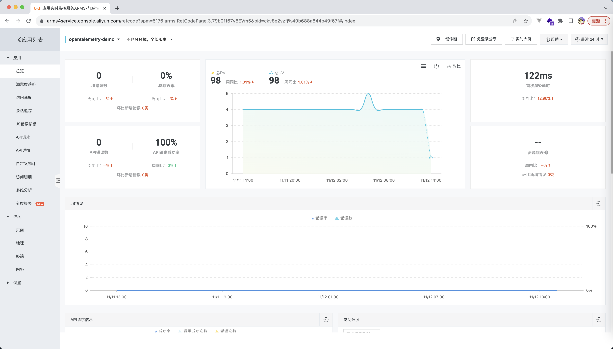
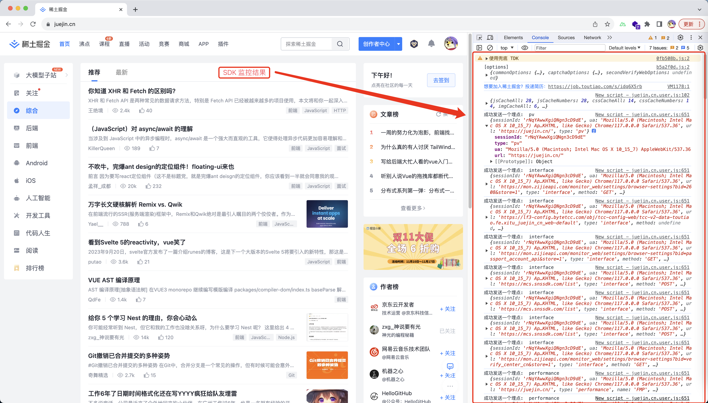

# 前端性能监控

## 什么是前端性能监控

前端监控是一个监控工具，它能够监控如下的数据:

1. 运行时性能
2. 运行时错误
3. 接口请求状况
4. 用户的行为



## 前端性能监控架构


## 性能监控 sdk 架构


# 数据的监控

## 性能监控

### 什么叫做 web 的性能监控

web 的性能监控就是指在页面加载各个关键时间点的耗时，能够帮助我们分析页面的性能


### 一些常见的性能监控指标

FP: 页面第一个像素绘制到屏幕上的时间
FCP: 页面首次内容(文本、图片、canvas)绘制到屏幕上的时间
DOMContentLoaded: 当初始的 HTML 文档被完全加载和解析完成
Load: 页面所有资源加载完成
缓存命中率: img,css,js 使用缓存的占比
FMP: 页面首屏渲染时间(移动端比较关注)
LCP: 视口内可见的最大图片或文本块的呈现时间

DNS 解析耗时: url DNS 解析耗时
TCP 连接耗时: 建立 TCP 连接耗时
SSL 安全链接耗时: SSL 安全链接建立完成的耗时
Request 耗时: 网页加载流程中 Request 的耗时
Response 耗时: 网页加载流程中 Response 的耗时
html 文档加载耗时: 从输入 url 开始加载资源到获取到 url html 资源所消耗的时间

[前端监控 SDK 的一些技术要点原理分析](https://juejin.cn/post/7017974567943536671#heading-35)

### 性能监控指标的获取

1. performance API: 大多数的性能指标依靠这个 API 可以获取值
2. PerformanceObserver 性能度量事件: LCP, CLS
3. 自定义算法: FMP, 缓存命中率


### 常用指标的计算

```js
const entries = performance.getEntries();
const p = entries[0];

// 常用指标
const DCL = p.domContentLoadedEventEnd - p.fetchStart;
const L = p.loadEventEnd - p.fetchStart;
const cacheObj = getCacheData();

// 非常用指标
const DNSTime = p.domainLookupEnd - p.domainLookupStart;
const TCPTime = p.connectEnd - p.secureConnectionStart;
const SSLTime = p.connectEnd - p.connectStart;

let t1 = undefined;
let t2 = undefined;

entries.forEach((ele) => {
  if (ele.name === 'first-paint') {
    /*  */
    t1 = ele.startTime - p.fetchStart;
  } else if (ele.name === 'first-contentful-paint') {
    t2 = ele.startTime - p.fetchStart;
  }
});

const result = `
  FP: ${t1}
  FCP: ${t2}
  DOMContentLoaded: ${DCL}
  Load: ${L}

  DNS解析耗时: ${DNSTime}
  TCP连接耗时: ${TCPTime}
  SSL安全链接耗时: ${SSLTime}
`;
```

### LCP 的计算

```js
new PerformanceObserver((entryList) => {
  for (const entry of entryList.getEntries()) {
    console.log('LCP DOM=', entry.element, `time=${entry.startTime}`);
  }
}).observe({ type: 'largest-contentful-paint', buffered: true });
```


## 接口请求监控

接口监控的本质其实就是重写 XMLHttpRequest/Fetch 对象，我们就能统计到下面这些数据

1. 请求时间
2. 请求的数量
3. 请求的成功率

```js
// @ts-ignore
!(function () {
  const originalFetch = window.fetch;

  /**
   *
   * @param {Function} paramsFormat XMLHttpRequest 接口上报参数格式化函数
   */
  const initFetch = (
    paramsFormat = (response = { diff: 0 }) => ({ diff: response.diff })
  ) => {
    window.fetch = function newFetch(url, config) {
      // 开始时间
      const startTime = Date.now();

      return originalFetch(url, config)
        .then((res) => {
          // 结束时间
          const endTime = Date.now();
          // 请求耗时
          const diff = endTime - startTime;

          const params = paramsFormat({
            ...res,
            ...config,
            url,
            startTime: startTime,
            endTime: endTime,
            diff,
          });
          console.log(
            `请求方法: ${config.method}; 请求路径: ${url}; 请求耗时: ${diff}; \n监控参数为`,
            params
          );

          return res;
        })
        .catch((err) => {
          console.log('err: ', err);

          throw err;
        });
    };
  };

  initFetch((response) => ({
    url: response.url,
    method: response.method,
    startTime: response.startTime,
    endTime: response.endTime,
    diff: response.diff,
  }));
})();
```

## 错误监控

在 web 中，错误监控关心的场景有：

1. 资源加载错误: error 事件
2. js 错误: onerror 回调
3. promise 错误: unhandledrejection 事件

```js
window.addEventListener(
  'error',
  (e) => {
    const { target } = e;
    const tag = target.tagName;
    const url = target.src || target.href;
    console.log(`捕获到了加载错误, 加载标签类型为 ${tag}; 资源 url 为 ${url}`);
  },
  // 错误的监听必须在捕获的时候进行监听
  true
);

window.onerror = (message, source, lineno, colno, error) => {
  console.log('捕获到异常：', { message, source, lineno, colno, error });
};

window.addEventListener('unhandledrejection', (e) => {
  console.log('e: ', e);
});
```

## 用户行为监控

用户的行为，可以分为下面几个方面：

1. 页面访问量(pv)
2. 行为点 click
3. 曝光点 exposure
4. 页面停留时长
5. 页面访问链路&深度

个人的观点是：
性能 sdk 只需要关注页面访问量 pv 即可

# 数据上报

1. XMLHttpRequest
2. Image 对象(无跨域，损耗小，请求优先级低)
3. sendBeacon(无跨域，损耗最小，可保证卸载前发出)

性能排序: sendBeacon > Image 对象 > XMLHttpRequest

# 性能监控 sdk 架构设计

## 基本架构

```js
class PerformaceOulaeSdk {
  constructor(obj) {
    // log promise 队列
    this.promiseCache = Promise.resolve();
    // 页面的会话id
    this.sessionId = undefined;

    // sdk 初始化函数
    this.init();
  }
  /**
   * sdk 基础配置和公参的初始化
   */
  sdkLogInit() {
    let _resolve = undefined;
    let _reject = undefined;
    this.promiseCache = new Promise((resolve, reject) => {
      _resolve = resolve;
      _reject = reject;
    });

    // 这里假设我们的初始化流程是非常慢的，最起码需要 3 秒钟
    setTimeout(() => {
      this.sessionId = Math.random();
      _resolve();
    }, 3000);
  }
  init() {
    // 埋点 log 的初始化
    // sessionId 的初始化
    this.sdkLogInit();

    // TODO: 性能监控数据脚本初始化
    // TODO: 接口请求监控脚本初始化
    // TODO: 错误监控脚本初始化

    // TODO: 发送一个页面的pv点
  }
  log(...params) {
    this.promiseCache.then(() => {
      // 调用埋点
      // TODO: 将埋点发送给服务端
      console.log('成功发送一个埋点: ', params);
    });
  }
}
```

## 数据轮转流程


## 测试结果



# 生产环境使用

这里我们只是完成了一个轻量级的性能监控 SDK，他能帮忙我们在 本地/测试环境 获取一些我们需要的数据，满足我们页面分析，性能优化的诉求

但是如果生产环境需要这些数据的话，还是推荐付费购买相关的产品

# 参考链接

## 系列&demo 相关

1. [github blog](https://github.com/ouleWorld/oulae_blog_warehouse/tree/main/markdown/%E6%80%A7%E8%83%BD%E4%BC%98%E5%8C%96)
2. [demos 仓库](https://github.com/ouleWorld/oulae_blog_warehouse/tree/main/markdown/%E6%80%A7%E8%83%BD%E4%BC%98%E5%8C%96/demos)
3. [浏览器渲染流程](https://www.w3.org/TR/navigation-timing-2/timestamp-diagram.svg)
4. [测试 url - ieubs](https://ieubs.9game.cn/m/home/all?keyword=%E5%89%91%E4%B8%8E%E8%BF%9C%E5%BE%81)
5. [测试 url - 交易猫](https://m.jiaoyimao.com/)

## 参考资料

1. [深入了解前端监控原理](https://juejin.cn/post/6899430989404045320)
2. [前端监控 SDK 的一些技术要点原理分析](https://juejin.cn/post/7017974567943536671#heading-35)
3. [腾讯二面：现在要你实现一个埋点监控 SDK，你会怎么设计？](https://juejin.cn/post/7085679511290773534#heading-6)
4. [web.dev](https://web.dev/explore/fast?hl=zh-cn)
5. [github - web-vitals](https://github.com/GoogleChrome/web-vitals/tree/main)
