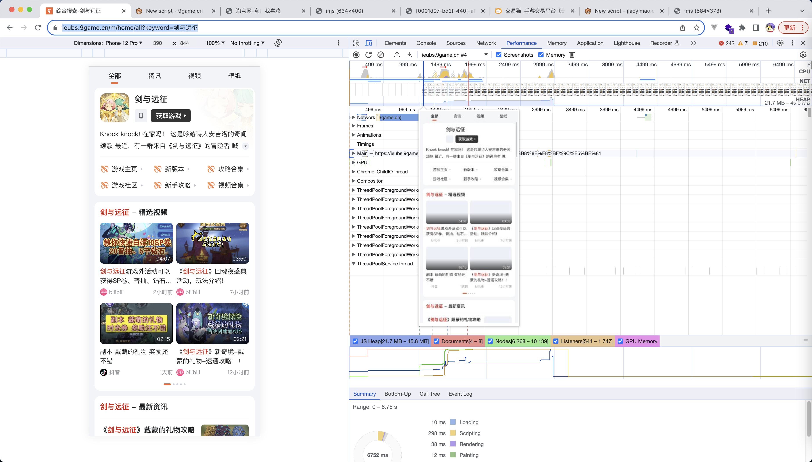
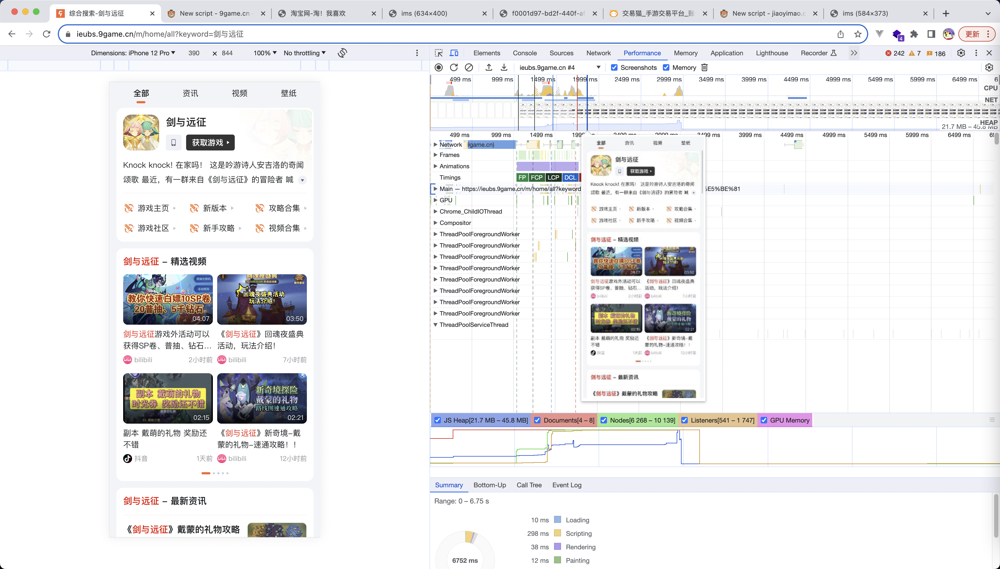
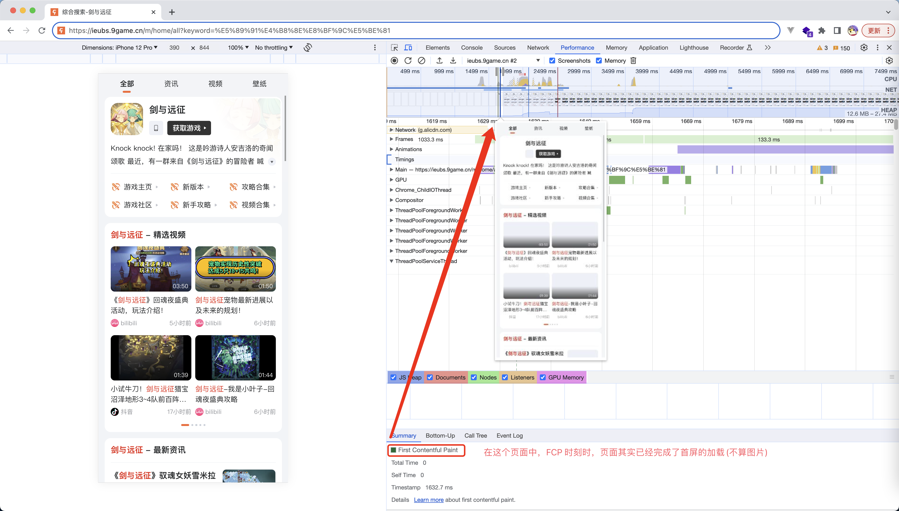
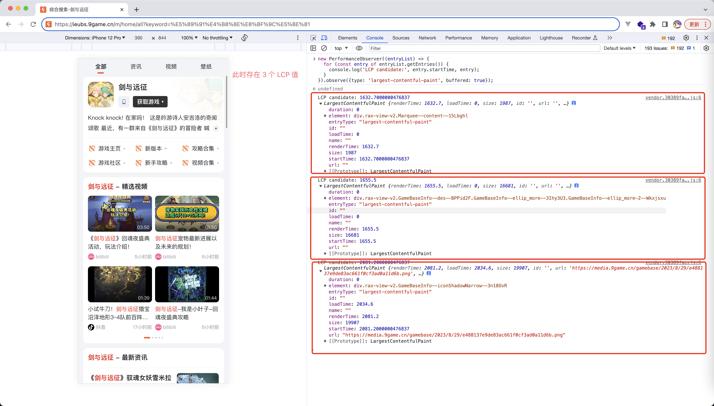
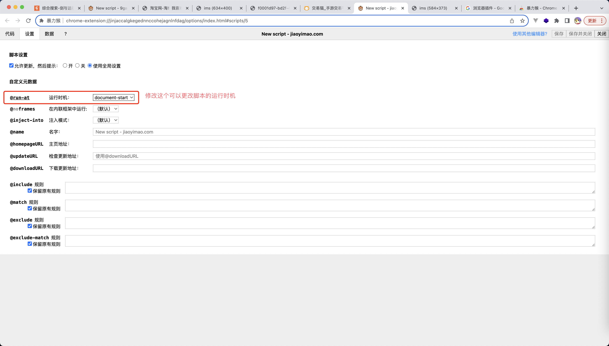
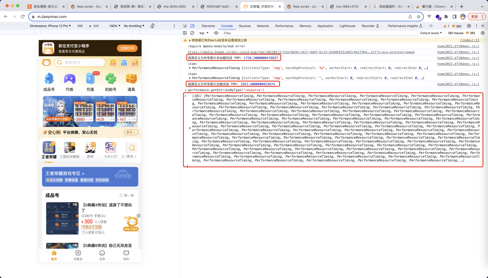
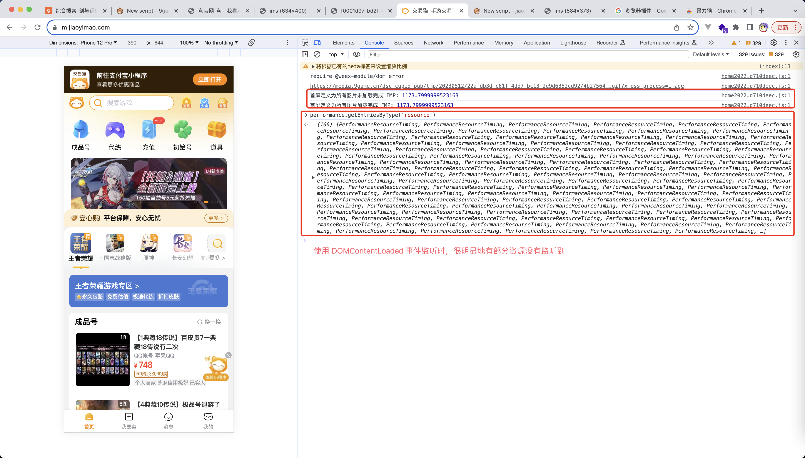

# 阅读须知

**如果指标中定义标注了超链接，则建议直接阅读超链接资料进行指标的理解**

# 常用指标

## 白屏时间

定义: 从输入网址，到页面开始显示内容的时间
计算方法:

```js
!function () {
  const fn = () => {
    const entries = performance.getEntries();
    const p = entries[0];
    const whiteScreenTime = p.domInteractive - p.redirectStart;
  };

  if (document.readyState === 'complete') {
    fn();
  } else {
    window.addEventListener('load', (event) => {
      setTimeout(() => {
        fn();
      });
    });
  }
};
```

## FP

定义: 从页面加载开始到第一个像素绘制到屏幕上的时间
计算方法:

```js
!function () {
  const fn = () => {
    const entries = performance.getEntries();
    let t1 = undefined;

    entries.forEach((ele) => {
      if (ele.name === 'first-paint') {
        t1 = ele.startTime - p.fetchStart;
      }
    });
  };

  if (document.readyState === 'complete') {
    fn();
  } else {
    window.addEventListener('load', (event) => {
      setTimeout(() => {
        fn();
      });
    });
  }
};
```

## FCP

定义: [First Contentful Paint (FCP)](https://web.dev/articles/fcp?hl=zh-cn)
计算方法:

```js
!function () {
  const fn = () => {
    const entries = performance.getEntries();
    let t2 = undefined;

    entries.forEach((ele) => {
      if (ele.name === 'first-contentful-paint') {
        t2 = ele.startTime - p.fetchStart;
      }
    });
  };

  if (document.readyState === 'complete') {
    fn();
  } else {
    window.addEventListener('load', (event) => {
      setTimeout(() => {
        fn();
      });
    });
  }
};
```

## LCP

定义: [https://web.dev/articles/lcp?hl=zh-cn](https://web.dev/articles/lcp?hl=zh-cn)
计算方法:

```
new PerformanceObserver((entryList) => {
  for (const entry of entryList.getEntries()) {
    console.log('LCP candidate:', entry.startTime, entry);
  }
}).observe({type: 'largest-contentful-paint', buffered: true});
```

注意点：

1. 在一个页面中，LCP 的指标是可能存在多个的
2. 如果业务场景很关心 LCP 指标的话，推荐阅读 [web-vitals onLCP](https://github.com/GoogleChrome/web-vitals/blob/main/src/onLCP.ts) 资料
3. LCP 技术设计上是一个 FMP 的等性质表，不过具体的细节是根据业务场景来决定的

### LCP 指标用户替代 FMP

TODO: LCP 值其实存在多个，注意取舍问题

## CLS

定义: [Cumulative Layout Shift (CLS)](https://web.dev/articles/cls?hl=zh-cn)
计算方法:

```js
new PerformanceObserver((entryList) => {
  for (const entry of entryList.getEntries()) {
    console.log('Layout shift:', entry);
  }
}).observe({ type: 'layout-shift', buffered: true });
```

注意点:

1. 如果业务场景关心 CLS 指标，推荐阅读 [github onCLS](https://github.com/GoogleChrome/web-vitals/blob/main/src/onCLS.ts)

TODO: 这里可以添加一个图片的 CLS 场景

## DOMContentLoaded

定义: 当初始的 HTML 文档被完全加载和解析完成之后，DOMContentLoaded 事件被触发，而无需等待样式表、图像和子框架的完全加载。
计算方法:

```js
!function () {
  const fn = () => {
    const entries = performance.getEntries();
    const p = entries[0];

    const DCL = p.domContentLoadedEventEnd - p.fetchStart;
  };

  if (document.readyState === 'complete') {
    fn();
  } else {
    window.addEventListener('load', (event) => {
      setTimeout(() => {
        fn();
      });
    });
  }
};
```

## load

定义: 页面所有资源加载完成
计算方法:

```js
!function () {
  const fn = () => {
    const entries = performance.getEntries();
    const p = entries[0];

    const L = p.loadEventEnd - p.fetchStart;
  };

  if (document.readyState === 'complete') {
    fn();
  } else {
    window.addEventListener('load', (event) => {
      setTimeout(() => {
        fn();
      });
    });
  }
};
```

## FMP

定义: First Meaningful Paint, 首屏渲染时间(**移动端场景下可能会比较关注这个指标**)

这里需要注意一个点，FMP 其实也是存在两种情况的：

1. 首屏定义为所有图片未加载完成
2. 首屏定义为所有图片加载完成

举个例子：

示例网站：https://ieubs.9game.cn/m/home/all?keyword=%E5%89%91%E4%B8%8E%E8%BF%9C%E5%BE%81

如果首屏定位所有图片未加载完成，则 FMP 应该为这种状态


如果首屏定义为所有图片加载完成，则 FMP 应该为这种状态


FMP 这个指标是一个较复杂的指标，参照 [First Meaningful Paint](https://developer.chrome.com/docs/lighthouse/performance/first-meaningful-paint/) 查看

简单来说就是，浏览器本身并没有提供一个 API 去查询页面的 FMP 指标(Chrome Lighthouse 有提供，但是这样不具备 SDK 数据上报的能力)

因此业务如果关注这个指标的话，需要自己去计算这个指标，下面提供几种计算的思路

### SSR 页面，使用 FCP 进行替换

**这种情况下，默认首屏定义为所有图片未加载完成**

在 SSR 的场景下，由于服务器是直接返回所有的 HTML 的，此时页面直接渲染 HTML 就可能完成页面绘制，不需要等待 js 解析器的运行，因此页面渲染速度会较快；这种情况下，我们可以直接使用 FCP 指标替代 FMP (会有误差，但是不会太大)

下面我们来举一个例子:

测试链接: https://ieubs.9game.cn/m/home/all?keyword=%E5%89%91%E4%B8%8E%E8%BF%9C%E5%BE%81


不过这里有一个注意点，一个页面的 FCP 值是会存在多个的


因此我们使用 FCP 进行作为首屏渲染时间指标时，需要进行数据过滤：

1. 上报时过滤
2. 数据报表过滤

### 使用 MutationObserver 手动计算首屏渲染时间

**这种方案兼容两种情况，既可以计算首屏定义为所有图片未加载完成，也可以计算首屏定义为所有图片加载完成**

**算法来源: [前端监控 SDK 的一些技术要点原理分析](https://juejin.cn/post/7017974567943536671), 感兴趣的读者可以参见这个链接去了解**

这里简单阐述一下计算过程：

1. 利用 MutationObserver 监听 document 对象，每当 document 插入新的 DOM 时，触发计算
2. 判断当前元素是否处于首屏内，如果处于首屏内，则使用 performance.now() 获取时间(requestAnimationFrame API 回调中获取，即重绘操作之前)
3. 如果首屏的定义包括图片，则将最后一个渲染的 DOM 和所有加载图片来做一次时间对比，将最大值作为首屏渲染时间

计算方法:

```js
// @ts-nocheck
!(function () {
  let observer = undefined; // MutationObserver 监听的对象
  let entries = []; // observer 监听的元素变动集
  const viewportWidth = window.innerWidth; // 页面宽度
  const viewportHeight = window.innerHeight; // 页面高度

  // MutationObserver 监听函数
  function observeFirstScreenPaint() {
    if (!MutationObserver) return;

    const next = window.requestAnimationFrame || setTimeout;

    // 不需要判断的 DOM
    const ignoreDOMList = ['STYLE', 'SCRIPT', 'LINK', 'META'];

    observer = new MutationObserver((mutationList) => {
      const entry = {
        startTime: 0,
        children: [],
      };

      // 在重绘之前获取时间
      next(() => {
        entry.startTime = performance.now();
      });

      for (const mutation of mutationList) {
        if (mutation.addedNodes.length) {
          for (const node of Array.from(mutation.addedNodes)) {
            if (
              node.nodeType === 1 &&
              !ignoreDOMList.includes(node.tagName) &&
              !isInclude(node, entry.children)
            ) {
              entry.children.push(node);
            }
          }
        }
      }

      if (entry.children.length) {
        entries.push(entry);
      }
    });

    observer.observe(document, {
      childList: true, // 监听 target 节点中发生的节点的新增与删除
      subtree: true, // 将会监听以 target 为根节点的整个子树。包括子树中所有节点的属性，而不仅仅是针对 target。默认值为 false
    });
  }

  function isInclude(node, arr) {
    if (!node || node === document.documentElement) {
      return false;
    }

    if (arr.includes(node)) {
      return true;
    }

    return isInclude(node.parentElement, arr);
  }

  // 判断一个元素是否需要计算
  function needToCalculate(node) {
    // 隐藏的元素不用计算
    if (window.getComputedStyle(node).display === 'none') return false;

    // 用于统计的图片不用计算
    if (node.tagName === 'IMG' && node.width < 2 && node.height < 2) {
      return false;
    }

    return true;
  }

  // dom 对象是否在屏幕内
  function isInScreen(dom) {
    const rectInfo = dom.getBoundingClientRect();
    if (
      rectInfo.left >= 0 &&
      rectInfo.left < viewportWidth &&
      rectInfo.top >= 0 &&
      rectInfo.top < viewportHeight
    ) {
      return true;
    }
  }

  // 获取 FMP
  function getRenderTime() {
    let startTime = 0;
    entries.forEach((entry) => {
      for (const node of entry.children) {
        if (
          isInScreen(node) &&
          entry.startTime > startTime &&
          needToCalculate(node)
        ) {
          startTime = entry.startTime;
          break;
        }
      }
    });

    console.log('首屏定义为所有图片未加载完成 FMP:', startTime);

    // 需要和当前页面所有加载图片的时间做对比，取最大值
    // 图片请求时间要小于 startTime，响应结束时间要大于 startTime
    performance.getEntriesByType('resource').forEach((item) => {
      if (
        item.initiatorType === 'img' &&
        item.fetchStart < startTime &&
        item.responseEnd > startTime
      ) {
        console.log('item: ', item);
        startTime = item.responseEnd;
      }
    });

    console.log('首屏定义为所有图片加载完成 FMP:', startTime);

    return startTime;
  }

  const __main = () => {
    window.addEventListener('load', () => {
      observer && observer.disconnect();
      getRenderTime();
    });

    observeFirstScreenPaint();
  };

  __main();
})();
```

#### 调试方法：如何在 web 渲染 body 之前插入自定义脚本

FMP 的计算脚本有点特殊，由于它使用 MutationObserver API 监听了 document 的变化，因此我们的脚本必须在 body tag 之前运行才行

要是先这个目的，我们可以使用浏览器插件: [暴力猴
](https://chrome.google.com/webstore/detail/violentmonkey/jinjaccalgkegednnccohejagnlnfdag?hl=zh-CN)



#### 注意点:获取 FMP 的时机问题

上面的获取方式中，我们在 load 时机进行 FMP 的获取，**这个时机是不能替换为 DOMContentLoaded 的**，如果替换为 DOMContentLoaded，那么很可能在 DOMContentLoaded 这个时机，图片的请求还没有发出去，这使得 performance.getEntriesByType('resource') 获取不到首屏的图片 PerformanceResourceTiming，从而造成计算误差

测试链接: https://m.jiaoyimao.com/

使用 load 计算 FMP


使用 DOMContentLoaded 计算 FMP


#### 注意点: 该算法计算 FMP 是存在误差的

这个算法计算出来的 FMP 其实是要小于真实的 FMP 的，这个其实很好理解

在首屏定义为所有图片未加载完成的情况时，由于我们取的时间是重绘之前的那一帧的时间，因此会比真实的 FMP 偏小(因为重绘是需要时间的)

在首屏定义为所有图片加载完成的情况时，我们是使用图片加载完成的那一刻的时间作为 endTime 的，因此会比真实的 FMP 偏小(因为图片的绘制需要时间)

不过这种误差是很小的，只要工具的口径定义好的，计算出来的 FMP 对业务来说还是具备有参考价值的

### 其他计算 FMP 的方法

FMP 的计算其实算是一个有争议的点，可能各个不同的工具都有一套计算方案，如果业务线本身购买了云服务商的相关服务，可以查阅文档看一下 FMP 的计算方法

**这个算是 FMP 这个指标的特殊点，其他指标的计算方式都是大差不差的，但是 FMP 可能会存在自建算法的可能性**

例如，阿里云的监控工具 arms 就提供了一种算法：

1. [页面访问速度](https://help.aliyun.com/zh/arms/browser-monitoring/user-guide/page-loading-speed?spm=a2c4g.11186623.0.0.6f8f615eevFD5E)
2. [前端监控 - 首屏统计的前世今生](https://zhuanlan.zhihu.com/p/44933789)

**如果要使用云服务商监控工具提供的 FMP 计算方法，一定要注意验证是否契合业务，笔者之前业务线使用 arms 计算出来的首屏差异就相对来说比较大**

# 非常用指标

## DNS 解析时间

定义: url DNS 解析耗时
计算方法:

```js
const entries = performance.getEntries();
const p = entries[0];
const whiteScreenTime = p.domainLookupEnd - p.domainLookupStart;
```

## TCP 连接耗时

定义: 建立 TCP 连接耗时
计算方法:

```js
const entries = performance.getEntries();
const p = entries[0];
const whiteScreenTime = p.connectEnd - p.connectStart;
```

## SSL 安全链接耗时

## 请求响应耗时 TTFB（Time to First Byte）

## 文档传输耗时

## 网页请求耗时

## 网页加载耗时

# 脚本

## 性能指标计算脚本

## FMP 计算脚本

# 模板

定义: 页面所有资源加载完成
计算方法:

```js

```
