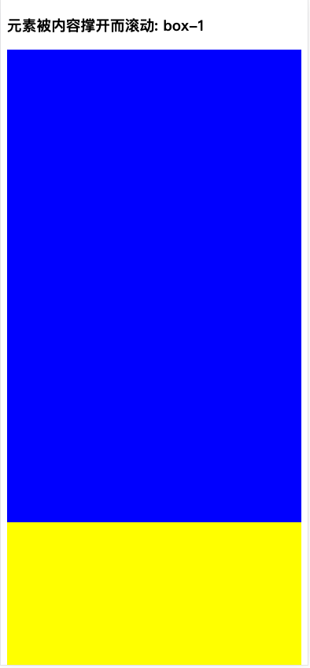
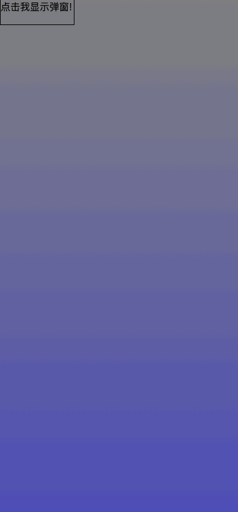

# 前置知识

## event.stopPropagation() 和 event.preventDefault()

event.stopPropagation()：阻止捕获和冒泡阶段中，当前事件的进一步传播，但是它不能阻止任何默认行为的发生，例如对链接的点击任然会被处理
event.preventDefault()：阻止事件发生默认的行为

## document.body 和 document.documentElement 的区别

document.body：表示 html 页面的 body 元素
document.documentElement：表示 html 页面的 html 元素

当我们需要获取一些属性时：clientHeight, scrollHeight, offsetHeight, scrollTop，我们通常的做法是：
clientHeight: 不包括 border 的宽高
offsetHeight: 包括 border 的宽高

```
const clientHeight = document.documentElement.clientHeight || document.body.clientHeight
const scrollHeight = document.documentElement.scrollHeight || document.body.scrollHeight
const offsetHeight = document.documentElement.offsetHeight || document.body.offsetHeight
const scrollTop = document.documentElement.scrollTop || document.body.scrollTop
```

**Q：为什么获取一个页面的宽高需要这样做？**
**A：暂时没有找到很明确的说明，就当是一个套路理解吧**

## 元素两种滚动的方式

1. 元素被内容高度撑开而滚动：元素没有设置 overflow 属性, 滚动是因为其元素高度超过了当前屏幕的高度而发生的滚动（此时滚动的主体并非元素本身，而是 document）
2. 元素被 css 属性设置而滚动：元素设置了 overflow 属性，滚动发生在元素内部

### 性质

元素被内容高度撑开而滚动：由于此时滚动的并非元素本身而是 document，因此此时 Element.scrollTop = 0
元素被 css 属性设置而滚动：由于此时滚动的是元素本身，因此我们能够获取 Element.scrollTop

### demo


[Element 滚动方式](./demos/Element滚动方式.html)

## passive event

### 基础介绍

passive=true: 表示 listener 永远不会调用 preventDefault()
passive=false: 表示 listener 可能会调用 preventDefault()

[passive 属性说明](https://developer.mozilla.org/zh-CN/docs/Web/API/EventTarget/addEventListener)
[使用 passive 改善的滚屏性能](https://developer.mozilla.org/zh-CN/docs/Web/API/EventTarget/addEventListener#%E4%BD%BF%E7%94%A8_passive_%E6%94%B9%E5%96%84%E7%9A%84%E6%BB%9A%E5%B1%8F%E6%80%A7%E8%83%BD)
[使用被动事件侦听器提高滚动性能](https://developer.chrome.com/blog/passive-event-listeners/)

### passive 能够提升滚动性能的原理

[passive 原理](https://developer.chrome.com/blog/passive-event-listeners/#how-it-works)

如果我们触发了 touchmove/scroll 事件时，浏览器要判断回调函数中是否包含 preventDefault()，因此要等待回调函数执行完才执行 touchmove/scroll 的默认行为，而执行回调函数是需要时间的，可能会让用户感受到延迟

而 Chrome 51 将 addEventListner 的 passive 默认设置为 true, 这样浏览器就能够知道这个 addEventListner 是不用执行 preventDefault() 的了，就能够立即触发滚动

### 兼容性

[passive 的兼容性](https://developer.mozilla.org/zh-CN/docs/Web/API/EventTarget/addEventListener#browser_compatibility)
[passive 兼容性检测](https://developer.mozilla.org/zh-CN/docs/Web/API/EventTarget/addEventListener#%E4%BD%BF%E7%94%A8_passive_%E6%94%B9%E5%96%84%E7%9A%84%E6%BB%9A%E5%B1%8F%E6%80%A7%E8%83%BD)

# 滚动透传

## 什么是滚动透传

[demo-什么是滚动透传](./demos/%E4%BB%80%E4%B9%88%E6%98%AF%E6%BB%9A%E5%8A%A8%E9%80%8F%E4%BC%A0.html)

如上述 demo 所示，我们能够发现两个现象：



1. 点击按钮显示弹窗，当 dialog_content 触底时，继续触发 touchmove 事件时，会发现：底部 page_content 事件也触发了滚动
2. 点击按钮显示弹窗，当 dialog_content 触顶时，继续触发 touchmove 事件时，会发现：底部 page_content 事件也触发了滚动

## W3C 关于 scroll 事件的规范

[W3C-scrolling](https://www.w3.org/TR/cssom-view/#scrolling-events#scrolling)

原文：
This section integrates with the event loop defined in HTML. [HTML]
本节与 html 中定义的事件循环集成

Each Document has an associated list of pending scroll event targets, initially empty.
每个 Document 都有一个决定滚动事件目标的关联列表，最开始它是空的

Whenever a viewport gets scrolled (whether in response to user interaction or by an API), the user agent must run these steps:
每当浏览器窗口被滚动时（无论这个响应是来自于用户行为还是 API），用户代理必须运行以下的步骤

1. Let doc be the viewport’s associated Document.
   doc = 当前滚动页面的全局对象 document

2. If doc is already in doc’s pending scroll event targets, abort these steps.
   如果当前页面的 document 对象已经在滚动事件目标的关联列表中，那么中止这些步骤

3. Append doc to doc’s pending scroll event targets.
   将当前页面的 document 对象添加到滚动事件目标的关联列表中

Whenever an element gets scrolled (whether in response to user interaction or by an API), the user agent must run these steps:
每当元素被滚动时（无论这个响应是来自于用户行为还是 API），用户代理必须运行以下的步骤

1. Let doc be the element’s node document.
   doc = 当前页面发生滚动的元素

2. If the element is already in doc’s pending scroll event targets, abort these steps.
   如果这个元素已经在滚动事件目标的关联列表中，那么中止这些步骤

3. Append the element to doc’s pending scroll event targets.
   将当前滚动的元素对象添加到滚动事件目标的关联列表中

When asked to run the scroll steps for a Document doc, run these steps:
当浏览器被要求执行滚动事件时，会执行如下的步骤

1. For each item target in doc’s pending scroll event targets, in the order they were added to the list, run these substeps:
   对于在滚动事件目标的每一个对象，执行如下的步骤

1. If target is a Document, fire an event named scroll that bubbles at target.
   如果当前目标是 Document 对象时，在 Document 上触发一个能够冒泡的 scroll 事件

1. Otherwise, fire an event named scroll at target.
   否则，向目标触发一个 scroll 事件（不冒泡）

1. Empty doc’s pending scroll event targets.
   清空滚动事件目标的关联类表中所有的元素

**_ 对于滚动事件目标的关联列表，它的原则是先进后出 _**

## 滚动透传的原因

首先，滚动其实并非我们实现的功能，所有的滚动效果都是浏览器实现的。

其次，scroll 事件相较于其他事件而言，scroll 事件只能在 Document 上冒泡，在普通元素上并不能发生冒泡(具体滚动哪一个元素使由浏览器绝的)

[demo-什么是滚动透传](./demos/%E4%BB%80%E4%B9%88%E6%98%AF%E6%BB%9A%E5%8A%A8%E9%80%8F%E4%BC%A0.html)

以这个 demo 为例；

如上述 demo 所示，我们能够发现两个现象：

1. 点击按钮显示弹窗，当 dialog_content 触底时，继续触发 touchmove 事件时，会发现：底部 page_content 事件也触发了滚动
2. 点击按钮显示弹窗，当 dialog_content 触顶时，继续触发 touchmove 事件时，会发现：底部 page_content 事件也触发了滚动

最开始，我们先定义一个 滚动事件目标的关联列表： const list = []

当发生第一种情况时：
touchmove 触发时，先会完成滚动事件目标的关联列表的添加: list = [ document, dialog_conent ]
接下来就是要触发滚动事件了，因此 scroll 事件被 dialog\*conent 消化掉了
当 dialog_content 触底时，由于 dialog_content 由于此时消化不了这个事件了（因为不能发生滚动改了），
**因此 dialog\*content 被踢出了滚动事件目标的关联列表, list = [document], 此时 scroll 事件被 document 消化，于是就发生了滚动透传**

当发生第二情况时：
和上述一致

## 滚动透传并不是一个 bug

按照之前我们对于滚动透传场景的描述，咋一看确实是一个 bug，但是从技术的角度上触发，这并不能理解为一个 bug。

[demo-滚动透传并不是一个 BUG](./demos/%E6%BB%9A%E5%8A%A8%E9%80%8F%E4%BC%A0%E5%B9%B6%E4%B8%8D%E6%98%AF%E4%B8%80%E4%B8%AABUG.html)
已这个 demo 为例：
在 PC 端时：
**_ 指针指向 box-2 _**
在 box-2，当触发 wheel/mousewheel 时，box-2 会发生滚动
当 box-2 触顶时，继续触发 wheel/mousewheel 时，**_ 此时用户的最真实的想法肯定是：整个页面向上移，因为这个内容不符合我的意愿 _**

在移动端时：
在 box-2，当触发 touchmove 时，box-2 会发生滚动
当 box-2 触顶时，继续触发 touchmove 时，**_ 此时用户的最真实的想法肯定是：整个页面向上移，因为这个内容不符合我的意愿 _**

scroll 触发机制，并没有变，这种场景是很符合用户的需求的！这是一种本能的理所应当的行为；
只不过这个场景在 dialog 类似的场景会发生问题，造成了业务上的困惑

## 结论

1. scroll 机制是一个很优秀的用户体验机制，只不过这个机制并不能兼容 dialog 的场景
2. 滚动透传本质上是 scroll 触发机制导致的，并不能算是一个技术上 bug
3. 只要元素在消化 scroll 事件，那么这个元素就会一直存在于滚动事件目标的关联列表中
4. 既然 scroll 这种机制会造成业务上的困扰，这个还是需要优化

# 错误的解决方案

## event.stopPropagation()

最开始遇到滚动透传问题，一开始确实是想到这个方案！

但是看了 scroll 的文档之后就会明白，这个方案压根不行。

## 清除滚动：overflow: hidden

原理：当 dialog 显示时，让 Document 从可滚动变更成为不可滚动
缺陷：

1. overflow 的变更会重置滚动条的位置，还是会造成体验问题
2. 如果层级过多，这个方案可能会是噩梦

## 阻止默认滚动

[滚动透传解决方案-阻止默认滚动](./demos/%E6%BB%9A%E5%8A%A8%E9%80%8F%E4%BC%A0%E8%A7%A3%E5%86%B3%E6%96%B9%E6%A1%88-%E9%98%BB%E6%AD%A2%E9%BB%98%E8%AE%A4%E6%BB%9A%E5%8A%A8.html)
原理：由 scroll 机制可知，只要元素在消化 scroll 事件，那么这个元素就会一直存在于滚动事件目标的关联列表中，这样 scroll 事件就不会发生透传了
缺陷：dialog 本身的的滚动事件也被禁止，这肯定不行，还得继续优化

# 正确地解决方案

## 选择性阻止默认滚动

原理说明：
监听元素的 touchmove 事件，当元素本身可以发生滚动时，并且触顶和触底时，我们阻止事件的默认行为

[滚动透传解决方案-选择性阻止默认滚动](./demos/%E6%BB%9A%E5%8A%A8%E9%80%8F%E4%BC%A0%E8%A7%A3%E5%86%B3%E6%96%B9%E6%A1%88-%E9%80%89%E6%8B%A9%E6%80%A7%E9%98%BB%E6%AD%A2%E9%BB%98%E8%AE%A4%E6%BB%9A%E5%8A%A8.html)
终极解决方案就是这个

## React 框架中的 ReactDOM.createPortal

原理说明：
ReactDOM.createPortal 会把元素挂载到目标 DOM 的尾部，利用这个特性，我们只需要保证目标 DOM (一般是 .root) 的父元素不能被滚动，我们就解决了滚动透传的问题；**本质上其实还是利用了 scroll 事件的特性，父元素没有元素能够触发滚动了，也就没有滚动透传的问题了**

[demo](./demos/react_scroll_penetrate/src/pages/dialog.tsx)

启动项目后访问的路由：http://127.0.0.1:8000/dialog

# 解决方案抽象

```js
/**
 * can-scroll: 元素本身支持 scroll，但是 scroll 触底，触顶时不希望 scroll 透传到其他元素中
 * no-scroll: 元素本身不支持 scroll，touchmove 发生时不希望 scroll 透传到其他元素中
 *
 * 特别注意点：
 * 1. 当前只支持针对 Y 轴方向的透传场景
 * 2. 当前只支持移动端的场景，如果要支持 PC 端的场景的话，需要进行事件的适配
 */
const documentEvent = () => {
  // 所有可以滚动的元素, 我们都加上 class属性: can-scroll 即可
  const scrollEl = document.querySelectorAll('.can-scroll');
  [].forEach.call(scrollEl, (el) => {
    let initialY = 0;
    el.addEventListener('touchstart', (e) => {
      if (e.targetTouches.length === 1) {
        /**
         * Q: 为什么这里要记录 clientY
         * A: 我们要使用这个 clientY 去判断当前的方向，以此来判断到底是触顶还是触底
         */

        // 读取并缓存当前触摸点的 Y 轴坐标
        initialY = e.targetTouches[0].clientY;
      }

      // 如果发生 .can-scroll 嵌套 .can-scroll，可能会触发多次校验逻辑，因此这里需要阻止冒泡
      e.stopPropagation();
    });

    el.addEventListener(
      'touchmove',
      (e) => {
        const scrollTop = el.scrollTop; // 页面滚动值
        const scrollHeight = el.scrollHeight; // 页面滚动的高度
        const clientHeight = el.clientHeight; // 页面元素的高度
        // console.log('initialY: ', initialY);
        // console.log('scrollTop: ', scrollTop);
        // console.log('scrollHeight: ', scrollHeight)
        // console.log('clientHeight: ', clientHeight);

        // scrollHeight !== clientHeight：只有页面是能够发生滚动时，才需要对滚动透传进行判断
        if (e.targetTouches.length === 1 && scrollHeight !== clientHeight) {
          const clientY = e.targetTouches[0].clientY - initialY;

          // 注意, 这里必须使用 e.cancelable, 否则可能会报错
          // 触底时，阻止事件的默认行为
          // 1. scrollTop + clientHeight >= scrollHeight: 触底判断
          // 2. clientY < 0：手势向下滑
          // 3. e.cancelable：事件可以被取消
          if (
            scrollTop + clientHeight >= scrollHeight &&
            clientY < 0 &&
            e.cancelable
          ) {
            // 触底时，我们取消 scroll 事件的
            return e.preventDefault();
          }

          // 注意, 这里必须使用 e.cancelable, 否则可能会报错
          // 1. scrollTop <= 0: 触顶判断
          // 2. clientY > 0: 手势向上滑动
          // 3. e.cancelable: 事件可以被取消
          if (scrollTop <= 0 && clientY > 0 && e.cancelable) {
            // 向上滑至顶部
            return e.preventDefault();
          }
        }
        // 如果发生 .can-scroll 嵌套 .can-scroll，可能会触发多次校验逻辑，因此这里需要阻止冒泡
        e.stopPropagation();
      },
      { passive: false }
    );
  });

  const noScrollEl = document.querySelectorAll('.no-scroll');
  [].forEach.call(noScrollEl, (el) => {
    // 需要不希望发生透传的元素，我们直接阻断事件的默认行为
    el.addEventListener(
      'touchmove',
      (e) => {
        if (e.cancelable) {
          e.stopPropagation();
        }
      },
      { passive: false }
    );
  });
};
```

**需要注意的是，passive: false 是会降低 scroll 的性能**
[解决方案抽象](./demos/utils.js)

# 结论

1. scroll 机制是一个很优秀的用户体验机制，只不过这个机制并不能兼容 dialog 的场景
2. 滚动透传本质上是 scroll 触发机制导致的，并不能算是一个技术上 bug
3. 只要元素在消化 scroll 事件，那么这个元素就会一直存在于滚动事件目标的关联列表中
4. 既然 scroll 这种机制会造成业务上的困扰，这个还是需要优化
5. 滚动透传解决方案：a)选择性阻止默认滚动 b)ReactDOM.createPortal

# 参考链接

1. [passive 属性说明](https://developer.mozilla.org/zh-CN/docs/Web/API/EventTarget/addEventListener)
2. [使用 passive 改善的滚屏性能](https://developer.mozilla.org/zh-CN/docs/Web/API/EventTarget/addEventListener#%E4%BD%BF%E7%94%A8_passive_%E6%94%B9%E5%96%84%E7%9A%84%E6%BB%9A%E5%B1%8F%E6%80%A7%E8%83%BD)
3. [使用被动事件侦听器提高滚动性能](https://developer.chrome.com/blog/passive-event-listeners/)
4. [passive 原理](https://developer.chrome.com/blog/passive-event-listeners/#how-it-works)
