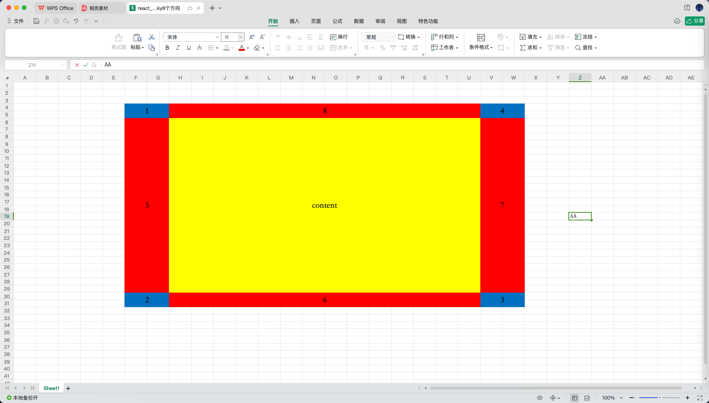

# 问题描述

react-window 是一个用于高效呈现大型列表和表格数据的 React 库
但是这个库本身并不直接支持固定表格行列
如果在使用 react-window 的时候存在固定行列需求，我们只能自己完成封装

# 实现原理 - 官方 demos & issues

如果要了解在 react-window 中如何实现固定头列(sticky 布局)，可以阅读下面资料：
[Does this library support "sticky" items?](https://github.com/bvaughn/react-window#does-this-library-support-sticky-items)
[Fixed grid headers with CSS position sticky #166](https://github.com/bvaughn/react-window/issues/166)
[固定行列表格基础 demo](./demos/7_react_window_%E5%9B%BA%E5%AE%9A%E8%A1%8C%E5%88%97%E8%A1%A8%E6%A0%BC/src/pages/GridWithStickyCells/index.jsx)

# 需求描述

对 react-window 实现二次封装，封装之后满足通过参数控制实现 4 个方向上(top, right, bottom, left)的 sticky 控制

# 实现

## 9 区块的图示

table 的场景下，如果需要实现 4 个方向上(top, right, bottom, left)的 sticky 布局，那么展示应该如下图所示

区域说明：
[1,2,3,4]: z-index 为最大值的区域，该区域不会随着滚动而发生内容的变化
[5,6,7,8]: z-index 处于中间值的区域，5,7 不会随着 x 轴的滚动而发变化；6,8 不会随着 y 轴的滚动而发生变化
[content]: z-index 为最小值的至于，是 table 的非 sticky 区域

## 9 区块的 html 实现

这种多区块布局 + sticky 布局，直接封装组件很容易出现问题，所以这里我们先使用 html + css 完成最基础的布局，然后才进行组件的开发

## 组件的封装

这个组件的封装的思路其实就是一句话：根据配置去计算各个容器需要展示的元素，然后展示就可以了

封装难点：
8 个 sticky 元素的 css 布局实现起来比较麻烦
**如果想要弄清楚实现细节，这里可以看下组件的实现细节，代码阅读难度不高，这里最难的地方其实这个 css 布局的处理**

[ReactWindowStickyCells](./demos/7_react_window_%E5%9B%BA%E5%AE%9A%E8%A1%8C%E5%88%97%E8%A1%A8%E6%A0%BC/src/components/ReactWindowStickyCells/index.jsx)
[demo 页面](./demos/7_react_window_%E5%9B%BA%E5%AE%9A%E8%A1%8C%E5%88%97%E8%A1%A8%E6%A0%BC/src/pages/Home/index.tsx)
