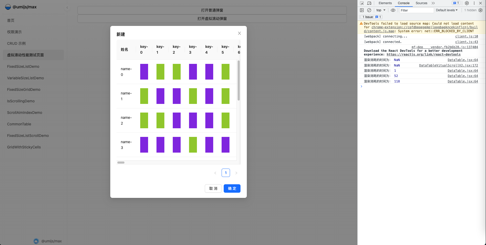
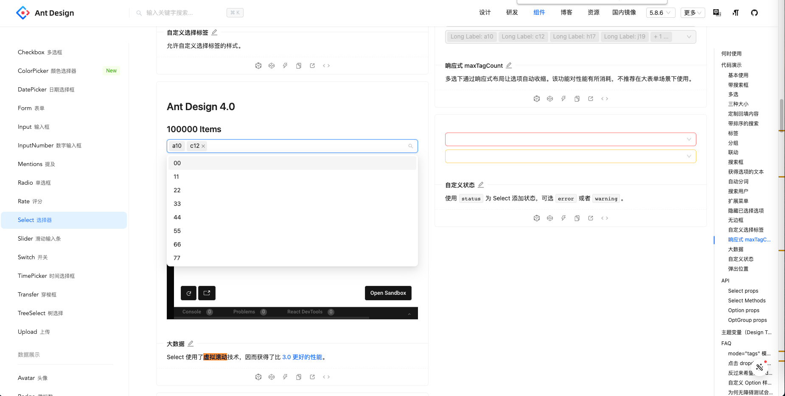
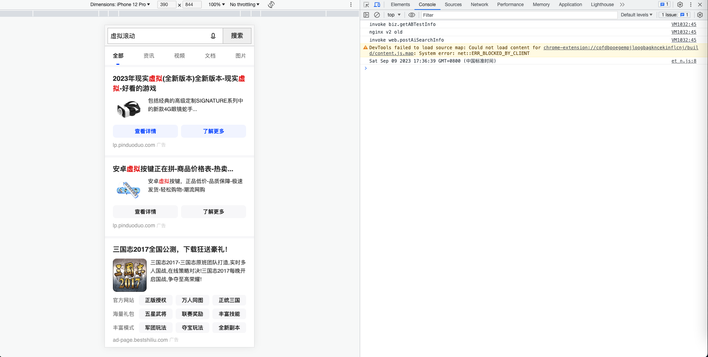

# 什么是虚拟滚动?

下面这张图说得很明白：
正常的滚动是指在滚动的容器中渲染出所有的元素，
虚拟滚动是指在滚动的容器只渲染可视区域内的元素，非可视区域内的元素不进行渲染

# 我们为什么需要虚拟滚动？

因为性能元素，当我们需要的页面需要渲染大量的元素时，虚拟滚动通常能够提升我们页面的性能

## 一个虚拟滚动的测试场景

测试页面：

测试的方案：
[测试页面](./demos/1_%E6%AD%A3%E5%B8%B8%E6%BB%9A%E5%8A%A8%E5%92%8C%E8%99%9A%E6%8B%9F%E6%BB%9A%E5%8A%A8%E6%95%B0%E6%8D%AE%E6%B5%8B%E8%AF%95/src/pages/DataTableTest/index.tsx)
startTime: 点击按钮这一刻的时间
endTime: 弹窗组件最后变化的时间，即 useEffect({})

测试的结果

# 虚拟滚动对于性能的影响

| 数据量 | 正常 table(首次) | 正常 table(非首次) | 虚拟滚动(首次) | 虚拟滚动(非首次) |
| ------ | ---------------- | ------------------ | -------------- | ---------------- |
| 100    | 76               | 63                 | 76             | 70               |
| 500    | 188              | 142                | 64             | 71               |
| 1000   | 336              | 218                | 83             | 79               |
| 2000   | 586              | 368                | 108            | 102              |
| 3000   | 841              | 548                | 142            | 102              |
| 5000   | 1348             | 796                | 205            | 144              |
| 10000  | 2609             | 1531               | 375            | 234              |
| 20000  | 5212             | 3127               | 782            | 409              |
| 30000  | 7807             | 4838               | 1019           | 523              |
| 50000  | 12972            | 8238               | 1909           | 933              |
| 100000 | 26828            | 18143              | 3719           | 2140             |

**由上述数据我们可知，当数据量到达到 10W 时，尽管虚拟滚动相较于正常 table 性能由很大的提升，但是速度还是非常慢的**

# 如何使用虚拟滚动

## 虚拟滚动的原理

[虚拟滚动的原理](./%E8%99%9A%E6%8B%9F%E6%BB%9A%E5%8A%A8%E7%9A%84%E5%8E%9F%E7%90%86.md)

## 一些常用的虚拟滚动库

### react-window

用于高效呈现大型列表和表格数据的 React 组件
使用场景: 在场景/列表中，如果需要渲染大量的数据，我们可以使用这个库

[github react-window](https://github.com/bvaughn/react-window)
[official document](https://react-window.vercel.app/#/examples/list/fixed-size)
[react-window demos 尝试](./demos/3_react_window_demos)

### react-virtualized-auto-sizer

一个自动获取父容器宽高的库
使用场景: 这个是一个工具组件，当我们需要监听父容器的宽高变化时，且需要实时获取 width,height 属性时，我们可以使用这个库
[github react-virtualized-auto-sizer](https://github.com/bvaughn/react-virtualized-auto-sizer)
[react-virtualized-auto-sizer demos 尝试](./demos/5_react_virtualized_auto_sizer_demo/)

### react-window-infinite-loader

受 react-virtualized 启发的 InfiniteLoader 组件，可与 react-window 一起使用
使用场景: 一般使用搜索结果页

[github react-window-infinite-loader](https://github.com/bvaughn/react-window-infinite-loader)
[react-window-infinite-loader demos 尝试](./demos/5_react_virtualized_auto_sizer_demo/)

### react-vtree

该软件包为渲染大型树结构提供了轻量级的灵活解决方案。它建立在 react-window 库之上。
使用场景: 需要渲染 tree 数据结构，且该结构数据量很大时，我们可以使用这个库

[github react-vtree](https://github.com/Lodin/react-vtree#readme)

## antd design 中的虚拟滚动

1. [Select](https://ant-design.antgroup.com/components/select-cn)
2. [TreeSelect](https://ant-design.antgroup.com/components/tree-select-cn)
3. [Table](https://ant-design.antgroup.com/components/table-cn)
4. [Tree](https://ant-design.antgroup.com/components/tree-cn)

## 实践-虚拟滚动中的固定行列功能

[react*window*固定行列表格](./react_window_%E5%9B%BA%E5%AE%9A%E8%A1%8C%E5%88%97%E8%A1%A8%E6%A0%BC.md)

# 思考：我们是否真的需要虚拟滚动

结论：除非存在明确的需求需要使用虚拟滚动去提升性能，否则不推荐使用虚拟滚动

## 项目维护角度

从项目迭代维护的角度，一般的原则是：在满足场景需求时，代码和实现方案越简单越好，可读性越高越好，虚拟滚动本身是会在增加代码的复杂性的
以 table 场景举例，直接 antd 能够兼容大部分的业务场景，同时也很容易应对各种需求变化，比如表格的合并，固定行列等等，但是如果使用了虚拟滚动的话，表格合并，固定行列都需要重新去思考怎么封装，开发的成本会增加很多

## 合理性

从合理性的角度，场景是否真的需要展示这么大的数据量
针对于数据的展示，其实是由通用的降级解决方案的：

1. 分页
2. 搜索选择

在使用虚拟滚动之前，应该去思考：常用的降级方案带来的交互性是不是会更好

# 使用虚拟滚动的注意点

当然，不排除某些场景我们一定要使用虚拟滚动，比如：

1. 商品展示页的无限下拉加载
2. 推荐流场景
3. 通讯录
4. 大型 tree 结构的展示

在这些通用场景，确实使用虚拟滚动能够带来更多的合理性和更好的交互，但是使用虚拟滚动技术本身是存在限制的，
之前也提及了，虚拟滚动本身的交互拓展性是存在困难的，可能需要自己的二次开发，如果要做特别的交互或者要做特别的场景化定制，可能会存在苦难
**因此在使用虚拟滚动场景时，一定要沟通好交互方式和展现形式，提前判断开发的难度**

# QA

**Q: 虚拟滚动为什么比传统的渲染性能要好呢？**
A:
针对大量的数据，渲染的瓶颈在于我们需要渲染大量的 DOM；这些 DOM 很大部分都是在不可见区域内的，同时渲染这部分 DOM 耗时又非常高；
因此我们可以采取一个方案：通过 js 的计算，只渲染目标区域的 DOM

在这个过程中：js 判断的耗时 < 渲染大量 DOM 的耗时
因此虚拟 DOM 能够提升渲染的性能！

**Q: 虚拟 DOM 更新的原理是什么？**
A:

1. 滚动事件发生之后，获取滚动之后的距离 offset
2. 将 offset 更新到 this 上去，set 操作会自动触发 this.render
3. 在 render 中我们计算出需要渲染的 DOM 内容，然后将其更新到页面中

# 参考链接

1. [react-window](https://github.com/bvaughn/react-window)
2. [react-window-demo](https://react-window.vercel.app/#/examples/list/scrolling-indicators)
3. [使用 react-window 虚拟化大型列表](https://web.dev/i18n/zh/virtualize-long-lists-react-window/)
4. [github - memoize-one](https://github.com/alexreardon/memoize-one)
