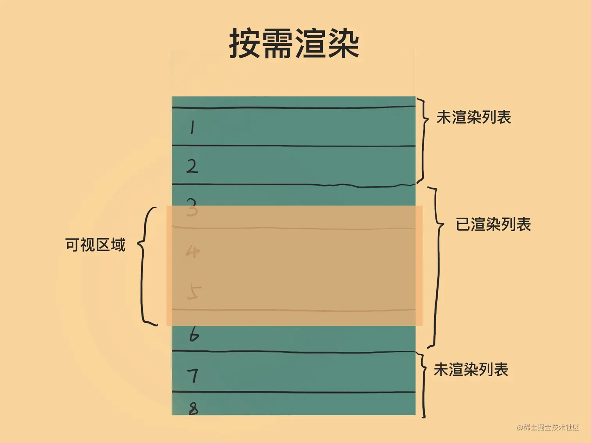
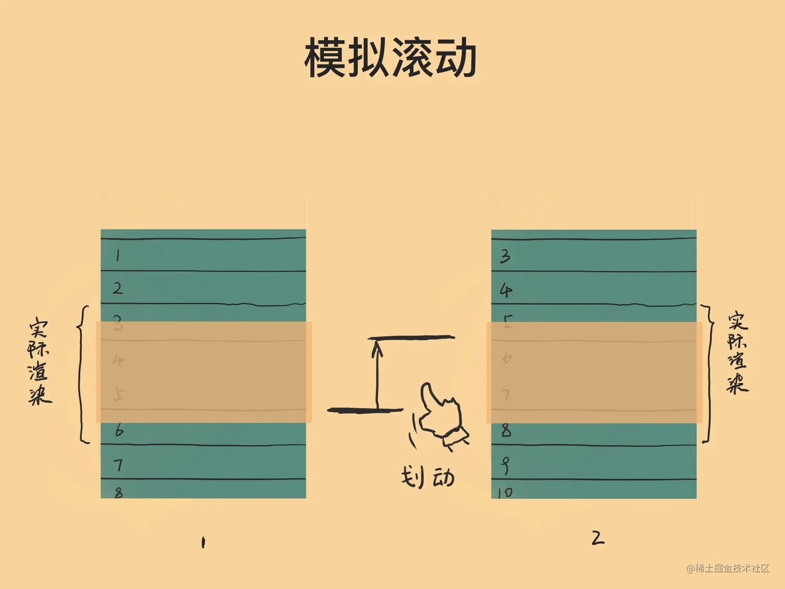

# 虚拟滚动的原理

如果真的想要了解原理，推荐看这两篇文章，讲的很清晰了

1. [新手也能看懂的虚拟滚动实现方法](https://juejin.cn/post/6844904183582162957?searchId=202307170606584E4881AE51E0D6D614DA)
2. [前端长列表滚动方案探讨，看完不要再说不知道怎么实现虚拟列表了](https://juejin.cn/post/7134997708598673439?searchId=202307170606584E4881AE51E0D6D614DA)

# 原理

虚拟滚动的原理其实可以拆分为两个部分：

1. 按需渲染
2. 模拟滚动

所谓的按需渲染是指，我们使用 js 判断出当前滚动的位置对应的元素具体是哪些，然后我们只需要渲染这部分元素即可(**这也是为什么虚拟滚动能够极大提升性能的原因，因为我们使用计算替代了渲染这个耗时的工作**)，具体的内容可参见下图：

所谓的模拟滚动是指：我们只渲染了能看得见的元素，这意味在页面中我们其实是没有原生滚动的功能的，我们需要去模拟滚动的行为，在用户触发滚动事件的时候滚动相应的列表，如下图所示：

# 实现

1. [虚拟滚动实现 - 简单场景](./demos/2_%E8%99%9A%E6%8B%9F%E6%BB%9A%E5%8A%A8%E7%9A%84%E5%AE%9E%E7%8E%B0/simpleIndex.html)
2. [虚拟滚动实现 - 优化场景](./demos/2_%E8%99%9A%E6%8B%9F%E6%BB%9A%E5%8A%A8%E7%9A%84%E5%AE%9E%E7%8E%B0/index.html)

# 虚拟滚动性能优化

## render 事件的节流

在虚拟滚动这个场景下，可预见很有可能会发生如下的交互

1. 用户高频率滚动滚动触发滚动
2. 用户高频率触发 scroll 事件(这个浏览器内部本身存在优化)

针对这种高频率的场景，一个非常常见的性能优化手段就是节流，因为我们对于触发 render 的行为进行节流操作即可(主要节流的频率不要影响到用户的交互效果)

## 列表缓存

如果按照最简单的实现，即只要滚动条 offset 发生变更，那么我们就需要重新 render 一次；但是这里其实也是存在优化的空间的：我们可能多渲染一些数据，保证在一些小的 scroll 场景下只需要修改 css 就可以达到渲染的目的，这个部分具体可参见 [虚拟滚动实现 - 优化场景](./demos/3_%E8%99%9A%E6%8B%9F%E6%BB%9A%E5%8A%A8%E7%9A%84%E5%AE%9E%E7%8E%B0/index.html)
